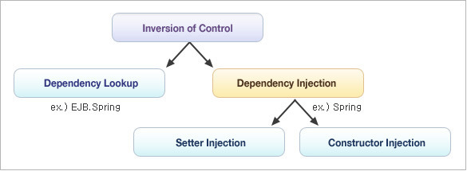

#  IoC(Inversion of Control) 
원본 URL : [Spring IoC와 DI](https://gangnam-americano.tistory.com/60)
##  IoC란? 
자바가 등장하고 자바 기반의 어플리케이션이 개발되던 초기에는 자바 객체를 생성하고 객체간의 의존관계를 연결하는 등의 제어권을 개발자가 직접 가지고 있었다. 그러나 서블릿, EJB가 등장하면서 개발자가 독점적으로 가지고 있더 제어권이 서블릿이나 EJB를 관리하는 외부 컨테이너로 넘어갔고 객체의 생성부터 소멸까지 생명주기의 모든 제어권이 바뀐 것을 IOC, 제어의 역전이라고 표현한다.

## IOC Container
모든 작업을 사용하는 쪽에서 제어하던 것을 IOC컨테이너에서 제어하게 되는데, 기본적으로 컨테이너는 객체를 생성하고 객체간의 의존성을 이어주는 역할을 한다.
스프링이 제공하는 IOC컨테이너는 BeanFactory와 이를 확장한 ApplicationContext가 있다.  

### BeanFactory
BeanFactory 인터페이스는 IOC컨테이터의 기능을 정의하고 있는 인터페이스이며, Bean의 생성 및 의존성 주입, 생명주기(lifecycle) 관리 등의 기능을 제공한다. 여기서 Bean이란 IOC컨테이너에 의해 생성되고 관리되는 객체를 의미한다.

### ApplicationContext
BeanFactory 인터페이스를 상속받는 ApplicationContext는 BeanFactory가 제공하는 기능 외에 AOP, 메세지처리, 이벤트 처리 등의 기능을 제공한다.  

모든 ApplicationContext 구현체는 BeanFactory의 기능을 모두 제공하므로, 특별한 경우를 제외하고는 ApplicationContext를 사용하는 것이 바람직하다. 

Spring프레임워크에서는 다수의 ApplicationContext를 제공하는데 ClassPathXmlApplicationContext를 생성하는 예시를 보자.

```java
ApplicationContext context = new ClassPathXmlApplicationContext("config/bean.xml");
MyBean bean = context.getBean("myBean");
```

## DI(Dependency Injection)
IOC를 구현하기 위한 방법으로 DL(Dependency Lookup)과 DI(Dependency Injection)이 있다.

다음은 IOC와 DI간의 관계를 분류한 그림이다.


### DL(Dependency Lookup) : 의존성 검색
컨테이너에서 제공하는 API를 이용해 사용하고자 하는 빈(Bean)을 저장소에서 Lookup하는 것을 말한다.

### DI(Dependency Injection) : 의존성 주입
각 객체간의 의존성을 컨테이너가 자동으로 연결해주는 것으로 개발자가 빈(Bean) 설정파일에 의존관계가 필요한 정보를 추가해주면 컨테이너가 자동적으로 연결해준다.

#### Setter Injection
Setter Injection은 인자(argument)가 없는 생성자를 사용하여 객체를 생성한 후, setter메소드를 사용하여 의존성을 주입하는 방식으로 <property/> element를 사용한다.  

```java
public class BeanExample {
    private MyBean beanOne;
    public void setBeanOne(MyBean beanOne){
        this.beanOne = beanOne;
    }
}
```
객체가 생성되고 의존성을 삽입하는 방식으로 구현시 좀더 유연할 수 있으며, setter메소드를 통해 값이 할당되기 전까지 객체를 사용할 수 없다.
ex) Setter Injection

```java
public class BeanExample {
    private MyBean beanOne;
    private YourBean beanTwo;
    public void setBeanOne(MyBean beanOne){
        this.beanOne = beanOne;
    }
    public void setBeanTwo(YourBean beanTwo){
        this.beanTwo = beanTwo;
    }
    public void setIntegerProperty(int i){
        this.i = i;
    }
}
```

```xml
<bean id="BeanExample" class="example.BeanExample">
    <property name="beanOne"><ref bean="MyBean"/></property>
    <property name="beanTwo" ref="YourBean" />
    <property name="IntegerProperty" value="1"></property>
</bean>
<bean id="MyBean" class="example.MyBean" />
<bean id="YourBean" class="example.YourBean" />
```

#### Constructor Injection
Constructor Injection은 인자(argument)를 갖는 생성자를 사용하여 의존성을 주입하는 방식으로 <constructor-arg/> element를 사용한다. 

```java
public class BeanExample {
    private int beanOne;
    public BeanExample(int beanOne){
        this.beanOne = beanOne;
    }
}
```
생성자에 파라미터를 지정함으로써 객체가 필요로하는 값을 알 수 있으며, setter없이 간단하게 지정이 가능하다.
ex) Constructor Injection
```java
public class BeanExample {
    private MyBean beanOne;
    private YourBean beanTwo;
    private int i;
    public BeanExample(MyBean beanOne, YourBean beanTwo, int i){
        this.beanOne = beanOne;
        this.beanTwo = beanTwo;
        this.i = i;
    }
}
```

```xml
<bean id="BeanExample" class="example.BeanExample">
    <constructor-arg name="beanOne"><ref bean="MyBean"/></constructor-arg>
    <constructor-arg name="beanTwo" ref="YourBean" />
    <constructor-arg name="IntegerProperty" value="1"/>
</bean>
<bean id="MyBean" class="example.MyBean" />
<bean id="YourBean" class="example.YourBean" />
```


