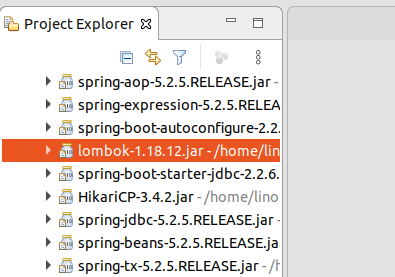
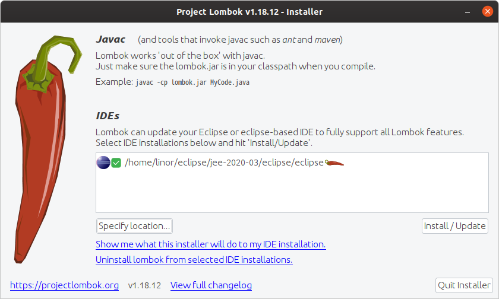
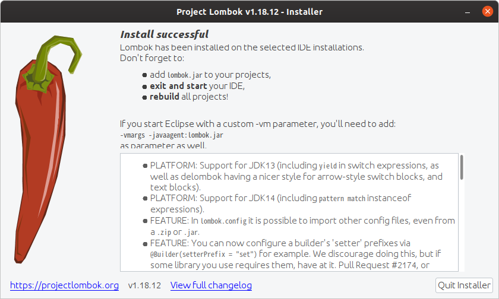
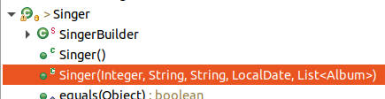

# JDBC Todo
이 프로젝트는 SpringBoot로 실행은 가능하나 테스트케이스는 실행되지 않는다.  
이 프로젝트는 다음에 진행할 모든 JDBC프로젝트의 기본 구조로 사용한다.  
사용하는 DBMS는 postgresql이다.  

Spring Boot JDBC개발을 진행하기 위한 준비과정으로 데이타베이스 설정,    
lombok설정, dao인터페이스, 테스트케이스를 준비한다.  

## 이클립스 추가 플러그인 설치
예제 프로젝트를 정상적으로 연습할 수 있도록 Spring Tool Suite와 Lombok가 설치되어 있어야 한다.  

## 데이타베이스 설정
postgres계정으로 다음 sql문들을 실행한다.  
### 계정 생성
```sql
CREATE USER linor WITH LOGIN;
ALTER USER PASSWORD 'sring1234';
```
로그인이 가능한 linor 계정으로 비밀번호는 'linor1234'로 설정하였다.

### 데이타베이스 생성
```sql
CREATE DATABASE spring WITH OWNER = linor;
```
spring이라는 데이타베이스를 생성하고 소유자는 위에서 만든 linor로 한다.

### 스키마 생성
```sql
CREATE SCHEMA singer
    AUTHORIZATION linor;
```
마지막으로 singer라는 스키마를 생성하고 소유자는 linor로 한다.

## Spring Boot Starter를 이용한 프로젝트 생성
Spring Boot -> Spring Starter Project로 생성한다.  

### 의존성 라이브러리
의존성 라이브러리 : devtools, lombok, postgresql, jdbc  

소스 : [pom.xml](pom.xml)
```xml
    <dependencies>
        <dependency>
            <groupId>org.postgresql</groupId>
            <artifactId>postgresql</artifactId>
            <scope>runtime</scope>
        </dependency>
        <dependency>
            <groupId>org.springframework.boot</groupId>
            <artifactId>spring-boot-starter-test</artifactId>
            <scope>test</scope>
        </dependency>
        <dependency>
            <groupId>org.springframework.boot</groupId>
            <artifactId>spring-boot-devtools</artifactId>
            <scope>runtime</scope>
        </dependency>
        <dependency>
            <groupId>org.projectlombok</groupId>
            <artifactId>lombok</artifactId>
        </dependency>
        <dependency>
            <groupId>org.springframework.boot</groupId>
            <artifactId>spring-boot-starter-jdbc</artifactId>
        </dependency>
    </dependencies>
```
## 설정
### lombok설정
lombok를 사용하면 자바 빈의 get,set메서드를 선언하지 않더라로 알아서 만들어 주므로 소스가 깔끔해 진다.
또한 slf4j log를 쉽게 선언하여 사용할 수 있도록 지원한다.  
  
Maven Dependencies에서 lombox-1.18.12.jar파일을 선택하고 Shit+Alt+X를 누른 다음 j를 눌러 실행한다.  

  
Specify Location...버튼을 클릭하여 위 그림 처럼 이클립스가 설치된 폴더를 선택하여 추가한다.
Intall/Update버튼을 클릭한다.

  
설치완료되면 위 그림과 같이 나나타며, Quit Installer버튼을 클릭하여 종료한 후 이클립스를 재시작한다.   

### 데이타베이스 호스트 설정
/etc/hosts파일에 다음 내용을 추가하여 localhost가 postgres서버로 인식하도록 한다.   
```hosts
127.0.0.1	localhost postgres
```

### 데이타 소스 설정
스프링부트에서 사용할 데이타소스를 설정한다.  
소스 : [application.yml](src/main/resources/application.yml)
```yml
spring:
  datasource:
    driver-class-name: org.postgresql.Driver
    url: jdbc:postgresql://postgres:5432/spring?currentSchema=singer
    username: linor
    password: linor1234
    initialization-mode: always
```
yml파일이 properties파일보다 시스템 설정사항을 효율적으로 관리할 수 있다.  
properties의 경우 Profile을 설정하려면 Profile별로 properties파일을 생성해야 하지만 yml은 하나의 파일에서 관리할 수 있다.  
datasource 설정에 필요한 속성은 driver-class-name, url, username, password이다.  
initialization-mode:
- always : spring boot시작시 schema.sql과 data.sql파일을 실행하여 데이타베이스의 테이블을 생성하고 데이타를 로드하여 데이타베이스를 초기화 한다.
- never : 데이타베이스를 초기화 하지 않는다.
- embedded : HSQL, H2와 같이 내장 데이타베이스를 사용하는 경우에 설정한다. 

### 데이타베이스 초기화 파일 생성
프로젝트 실행시 사용할 테이블을 생성하기 한 sql script파일로 application.yml에서     
spring.datasource.initialization-mode가 always인 경우 실행된다.  

소스 : [schema.sql](src/main/resources/schema.sql)
```sql
drop table if exists singer cascade;

create table singer(
  id serial not null primary key,
  first_name varchar(60) not null,
  last_name varchar(60) not null,
  birth_date date,
  constraint singer_uq_01 unique(first_name, last_name)
);

drop table if exists album cascade;

create table album(
  id serial not null primary key,
  singer_id integer not null,
  title varchar(100) not null,
  release_date date,
  constraint album_uq_01 unique(singer_id, title),
  constraint album_fk_01 foreign key (singer_id) references singer(id) on delete cascade
);

```

소스 : [data.sql](src/main/resources/data.sql)
```sql
insert into singer(first_name, last_name, birth_date)
values
('종서','김','19701209'),
('건모','김','19990712'),
('용필','조','19780628'),
('진아','태','20001101');

insert into album(singer_id, title, release_date)
values
(1, '아름다운 구속','20190101'),
(1, '날개를 활짝펴고','20190201'),
(2, '황혼의 문턱','20190301');
```

## Domain 클래스 생성
도메인 클래스는 보통 테이블에 대응되는 엔터티 클래스로 Singer와 Album클래스를 생성한다.  
  
소스 : [Singer.java](src/main/java/com/linor/singer/domain/Singer.java)
```java
@Data
@Builder
@AllArgsConstructor
@NoArgsConstructor
public class Singer {
	private Integer id;
	private String firstName;
	private String lastName;
	private LocalDate birthDate;
	
	@Singular
	private List<Album> albums = new ArrayList<Album>();
}
```
@Data, @Builder, @AllArgsConstructor, @NoArgsConstructor, @Singular는 모두 Lombok어노테이션이다.  
@Data는 자동으로 get/set메서드를 생성하여 코딩을 깔끔하게 작성할 수 있다.  
@Builder는 객체를 생성할 때 유용하게 사용한다. 사용법은 다음과 같다.
```java
		Singer singer = Singer.builder()
				.firstName("조한")
				.lastName("김")
				.birthDate(LocalDate.parse("1990-10-16"))
				.build();
```

@AllArgsConstructor는 모든 맴버변수를 가진 생성자를 만들도록 한다.  
@NoArgsConstructor는 맴버변수가 없는 생성자를 만들도록 한다.  
  
Singer()생성자는 @NoArgsConstructor가 만들었고,
Singer(Integer, String, String, LocalDate, List<Album>)는 @AllArgsConstructor가 만들었다.  
@Singular는 배열변수인 경우 여러건을 등록할 수 있도록 한다. 사용법은 다음과 같다.  
```java
		Singer singer = Singer.builder()
				.firstName("태원")
				.lastName("김")
				.birthDate(LocalDate.parse("1965-04-12"))
				.album(Album.builder()
						.title("Never Ending Story")
						.releaseDate(LocalDate.parse("2001-08-31"))
						.build()
						)
				.album(Album.builder()
						.title("생각이나")
						.releaseDate(LocalDate.parse("2009-08-14"))
						.build()
						)
				.album(Album.builder()
						.title("사랑할수록")
						.releaseDate(LocalDate.parse("1993-11-01"))
						.build()
						)
				.build();
```  
@Singular를 선언한 albums맴버변수에 album메서드를 이용하여 계속 객체를 추가할 수 있다.  

소스 : [Album.java](src/main/java/com/linor/singer/domain/Album.java)
```java
@Data
@Builder
@AllArgsConstructor
@NoArgsConstructor
public class Album {
	private Integer id;
	private Integer singerId;
	private String title;
	private LocalDate releaseDate;
}
```

## DAO인터페이스 생성
데이타베이스를 이용한 처리 인터페이스 선언으로 향후 이 인터페이스를 구현할 예정이다.  

소스 : [SingerDao.java](src/main/java/com/linor/singer/dao/SingerDao.java)  
```java
public interface SingerDao {
	List<Singer> findAll();
	List<Singer> findByFirstName(String firstName);
	String findNameById(Integer id);
	Singer findById(Integer id);
	String findFirstNameById(Integer id);
	void insert(Singer singer);
	void update(Singer singer);
	void delete(Integer singerId);
	List<Singer> findAllWithAlbums();
	void insertWithAlbum(Singer singer);
}
```

## Test Case 생성
Dao인터페이스를 테스트 할 테스트케이스를 생성한다.  
소스 : [SinerDaoTests.java](src/test/java/com/linor/singer/SingerDaoTests.java)
```java
@RunWith(SpringRunner.class)
@SpringBootTest
@Transactional
@Slf4j
public class SingerDaoTests {
	@Autowired
	private SingerDao singerDao;
	
	@Test
	public void contextLoads() {
	}
	
	@Test
	public void testFindNameById() {
		String name = singerDao.findNameById(1);
		assertTrue("종서 김".equals(name));
	}

	@Test
	public void testFindAll(){
		List<Singer> singers = singerDao.findAll();
		assertNotNull(singers);
		assertTrue(singers.size() == 4);
		log.info("가수목록");
		listSingers(singers);
		
		Singer singer = 
				Singer.builder()
				.firstName("길동")
				.lastName("홍")
				.birthDate(LocalDate.parse("1991-01-11"))
				.build();

		singerDao.insert(singer);
		
		singers = singerDao.findAll();
		assertTrue(singers.size() == 5);
		log.info("가수 추가 후 가수 목록");
		listSingers(singers);
		
		singerDao.delete(singer.getId());
		singers = singerDao.findAll();
		assertTrue(singers.size() == 4);
		log.info("가수 삭제 후 가수 목록");
		listSingers(singers);
		
	}
	
	
	private void listSingers(List<Singer> singers){
		for(Singer singer: singers){
			log.info(singer.toString());
		}
	}

	@Test
	public void testFindAllWidthAlbums() {
		List<Singer> singers = singerDao.findAllWithAlbums();
		assertTrue(singers.size() == 4);
		singers.forEach(singer -> {
			log.info(singer.toString());
		});
	}
	
	@Test
	public void testFindByFirstName() {
		List<Singer> singers = singerDao.findByFirstName("종서");
		assertTrue(singers.size() == 1);
		listSingers(singers);
	}

	@Test
	public void testFindbyId() {
		Singer singer = singerDao.findById(1);
		log.info("주키로 1개 레코드 검색 결과>>>");
		log.info(singer.toString());
	}
	
	@Test
	public void testSingerUpdate() {
		Singer singerOldSinger = singerDao.findById(1);
		log.info(">>> 김종서 수정 전 >>>");
		log.info(singerOldSinger.toString());
		Singer singer = Singer.builder()
				.id(1)
				.firstName("종서")
				.lastName("김")
				.birthDate(LocalDate.parse("1977-10-16"))
				.build();
		singerDao.update(singer);
		Singer singerNewSinger = singerDao.findById(1);
		log.info(">>> 김종서 수정 후 >>>");
		log.info(singerNewSinger.toString());
	}
	
	@Test
	public void testInsertSinger() {
		Singer singer = Singer.builder()
				.firstName("조한")
				.lastName("김")
				.birthDate(LocalDate.parse("1990-10-16"))
				.build();
		singerDao.insert(singer);
		List<Singer> singers = singerDao.findAll();
		log.info(">>> 김조한 추가후");
		listSingers(singers);
	}
	
	@Test
	public void testInsertSingerWithAlbum() {
		Singer singer = Singer.builder()
				.firstName("태원")
				.lastName("김")
				.birthDate(LocalDate.parse("1965-04-12"))
				.album(Album.builder()
						.title("Never Ending Story")
						.releaseDate(LocalDate.parse("2001-08-31"))
						.build()
						)
				.album(Album.builder()
						.title("생각이나")
						.releaseDate(LocalDate.parse("2009-08-14"))
						.build()
						)
				.album(Album.builder()
						.title("사랑할수록")
						.releaseDate(LocalDate.parse("1993-11-01"))
						.build()
						)
				.build();
		singerDao.insertWithAlbum(singer);
		List<Singer> singers = singerDao.findAllWithAlbums();
		listSingers(singers);
	}
}
```
테스트 케이스는 Junit 테스트 케이스로 현재 프로젝트에서는 인터페이스 구현체가 없어서 실행되지 않지만 
나머지 프로젝트에서 구현체를 생성 후 Junit을 실행하면 모두 실행되도록 하였다.  
- @RunWith는 JUnit 프레임워크가 내장된 Runner를 실행할 때 @RunWith내에 선언된 SpringRunner.class라는 클래스를 실행하도록 한다.
- @SpringBootTest는 테스트에 사용할 ApplicationContext를 쉽게 생성하고 조작할 수 있도록 한다.  
- @Transactional은 테스트케이스 실행 후 트랜잭션을 롤백한다.  
- @Slf4j는 Lombok어노테이션으로 Slf4j로거를 사용할 수 있도록 log맴버객체를 생성한다.
  
log가 Slf4j어노테이션이 생성한 맴버객에이다.  
사용법은 아래와 같다.  
```java
		log.info("가수목록");
```