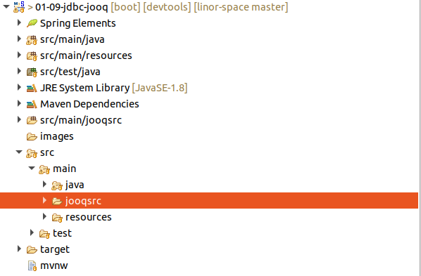
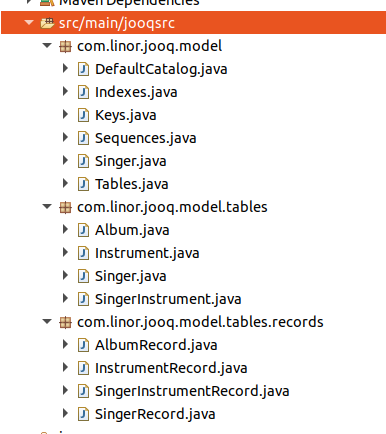
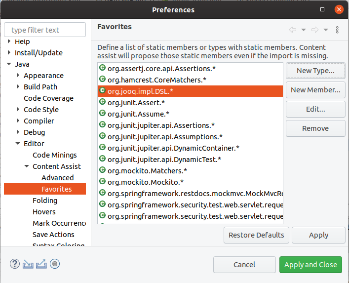
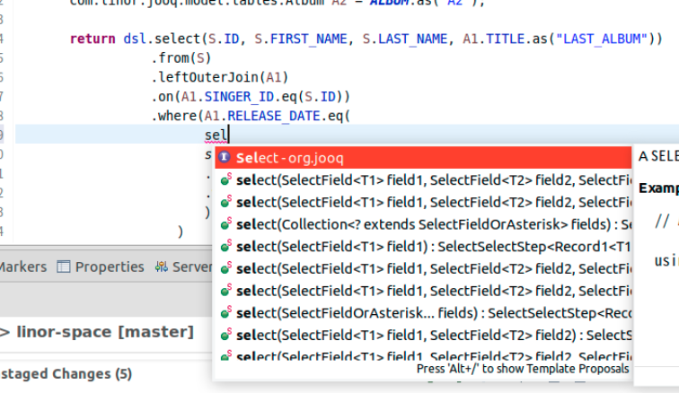

# JOOQ를 이용한 구현
SingerDao인터페이스를 JOOQ로 구현한다.  

JOOQ 홈페이지 : https://www.jooq.org/

## Spring Boot Starter를 이용한 프로젝트 생성
Spring Boot -> Spring Starter Project로 생성한다.  

### 의존성 라이브러리
todo 프로젝트 의존성 라이브러리에 spring-boot-starter-jooq, jooq-codegen, jooq-meta를 추가한다.  
소스 : [pom.xml](pom.xml)
```xml   
	<dependencies>
		<dependency>
			<groupId>org.postgresql</groupId>
			<artifactId>postgresql</artifactId>
			<scope>runtime</scope>
		</dependency>
		<dependency>
			<groupId>org.springframework.boot</groupId>
			<artifactId>spring-boot-starter-test</artifactId>
			<scope>test</scope>
		</dependency>
		<dependency>
			<groupId>org.springframework.boot</groupId>
			<artifactId>spring-boot-devtools</artifactId>
			<scope>runtime</scope>
		</dependency>
		<dependency>
			<groupId>org.projectlombok</groupId>
			<artifactId>lombok</artifactId>
		</dependency>
		<dependency>
			<groupId>org.springframework.boot</groupId>
			<artifactId>spring-boot-starter-jooq</artifactId>
		</dependency>
		<dependency>
			<groupId>org.jooq</groupId>
			<artifactId>jooq-codegen</artifactId>
		</dependency>
		<dependency>
			<groupId>org.jooq</groupId>
			<artifactId>jooq-meta</artifactId>
		</dependency>
	</dependencies>
```   

plugins에 jooq-codegen-maven, build-helper-maven-plugin플러그인을 추가한다.  
소스 : [pom.xml](pom.xml)
```xml   
		<plugins>
			<plugin>
				<groupId>org.springframework.boot</groupId>
				<artifactId>spring-boot-maven-plugin</artifactId>
			</plugin>
			<plugin>
				<groupId>org.jooq</groupId>
				<artifactId>jooq-codegen-maven</artifactId>
				<executions>
					<execution>
						<goals>
							<goal>generate</goal>
						</goals>
					</execution>
				</executions>
				<dependencies>
					<dependency>
						<groupId>org.postgresql</groupId>
						<artifactId>postgresql</artifactId>
						<version>${postgresql.version}</version>
					</dependency>
				</dependencies>
				<configuration>
					<jdbc>
						<driver>org.postgresql.Driver</driver>
						<url>jdbc:postgresql://postgres:5432/spring</url>
						<user>linor</user>
						<password>linor1234</password>
					</jdbc>
					<generator>
						<name>org.jooq.codegen.DefaultGenerator</name>
						<database>
							<name>org.jooq.meta.postgres.PostgresDatabase</name>
							<inputSchema>singer</inputSchema>
							<includes>.*</includes>
						</database>
						<target>
							<packageName>com.linor.jooq.model</packageName>
							<directory>src/main/jooqsrc</directory>
						</target>
					</generator>
				</configuration>
			</plugin>
			<plugin>
				<groupId>org.codehaus.mojo</groupId>
				<artifactId>build-helper-maven-plugin</artifactId>
				<executions>
					<execution>
						<phase>generate-sources</phase>
						<goals>
							<goal>add-source</goal>
						</goals>
						<configuration>
							<sources>
								<source>src/main/jooqsrc</source>
							</sources>
						</configuration>
					</execution>
				</executions>
			</plugin>
		</plugins>
```
jooq-codegen-maven플러그인은 DSL에서 사용할 Table, Record 등의 클래스 소스를 생성한다.  
- dependency에 사용할 데이타베이스 드라이버를 선언한다. version까지 등록해야 한다.  
- jdbc에 데이타베이스 접속정보를 설정한다.  
- database의 inputSchema에 해당 스키마를 선언한다.  
- target의 packageName에 생성할 패키지를 선언한다. 패키지 하위에 DSL에서 사용할 각종 클래스들이 생성된다.
- directory에 JOOQ소스생성기가 생성할 소스의 루트 저장소이다.  

build-helper-maven-plugin플러그인은 JOOQ가 생성할 소스 저장소를 이클립스가 자바소스 디렉토리로 인식할 수 있도록 한다.

jooq소스생성기가 생성할 소스를 저장할공간으로 src/main/jooqsrc폴더를 생성한다.  


프로젝트에서 maven update(Alt + F5)를 수행한 다음 Maven generate-sources를 수행한다.  
결과 src/main/jooqsrc에 소스가 생성된다.  



## 설정
소스 : [application.yml](src/main/resources/application.yml)  

### 데이타 소스 설정
todo 프로젝트와 동일하다.    

### 데이타베이스 초기화 파일 생성
todo 프로젝트와 동일하게 설정한다.  

소스 : [schema.sql](src/main/resources/schema.sql)  
소스 : [data.sql](src/main/resources/data.sql)  

## Domain 클래스 생성
소스 : [Singer.java](src/main/java/com/linor/singer/domain/Singer.java)  
소스 : [Album.java](src/main/java/com/linor/singer/domain/Album.java)  

## DAO인터페이스 생성

소스 : [SingerDao.java](src/main/java/com/linor/singer/dao/SingerDao.java)  

## SingerDao인터페이스 구현
JOOQ DSL API를 이용하여 SingerDao인터페이스를 구현한다.
소스 : [SingerDaoImpl.java](src/main/java/com/linor/singer/jooq/SingerDaoImpl.java)  

### import static
```java
import static com.linor.jooq.model.tables.Album.ALBUM;
import static com.linor.jooq.model.tables.Instrument.INSTRUMENT;
import static com.linor.jooq.model.tables.Singer.SINGER_;
import static org.jooq.impl.DSL.*;
```
JDK 1.5부터는 정적(static) 메소드와, 정적 변수를 쉽게 사용하기 위해서 static import 를 지원한다.  

이클립스에서 Ctrl + Space 를 누르면 Code Assist가 동작하여 처음 몇자만 입력하면 필요한 클래스의 import 나 사용 가능한 메소드를 추천 또는 자동완성을 해준다. 하지만 static import 는 기본적으로 자동으로 인식하지 못한다.  
이클립스에서 static 멤버에 대한 Code Assist 를 지원하기 위해서는 사용할 클래스를 Favorites 에 등록하여 사용할 수 있다.  
- Window -> Preferences > Java/Editor/Content Assist/Favorites에서 New Type 으로 클래스를 등록한다.  
- 여기서는 org.jooq.impl.DSL 클래스를 등록하면 org.jooq.impl.DSL.* 로 표시된다.


DSL멤버 메서드인 select가 제안되어 팝업으로 나타나는 것을 확인할 수 있다.

 
### Service 등록
```java
@Service
@Transactional
public class SingerDaoImpl implements SingerDao {
	@Autowired
	private DSLContext dsl;
```
@Service와 @Transactional을 선언하여 서비스 빈으로 사용할 수 있도록 한다.  
JOOQ DLS API를 사용하기 위해 DSLContext를 @Autowired로 선언하여 스프링이 자동으로 객체를 생성하도록 한다.   

### Record 매핑 Utility메서드 구현
JOOQ Record를 도메인 객체에 담을 Utility 메서드를 구현한다. 
```java
	private Singer getSingerDomain(Record record) {
		return Singer.builder()
				.id(record.getValue(SINGER_.ID))
				.firstName(record.getValue(SINGER_.FIRST_NAME))
				.lastName(record.getValue(SINGER_.LAST_NAME))
				.birthDate(record.getValue(SINGER_.BIRTH_DATE, LocalDate.class))
				.build();
	}
	private Album getAlbumDomain(Record record) {
		return Album.builder()
				.id(record.getValue(ALBUM.ID))
				.singerId(record.getValue(ALBUM.SINGER_ID))
				.title(record.getValue(ALBUM.TITLE))
				.releaseDate(record.getValue(ALBUM.RELEASE_DATE, LocalDate.class))
				.build();
	}
```

### findAll 메서드 구현
```java
	@Override
	public List<Singer> findAll() {
		List<Singer> singers = new ArrayList<Singer>();
		Result<Record> result = dsl.select().from(SINGER_).fetch();
		for(Record record: result) {
			singers.add(getSingerDomain(record));
		}
		return singers;
	}
```
dsl을 이용하여 select쿼리를 작성한다.  
여러개의 레코드를 받기 위해 fetch()를 사용하고, 단일 레코드를 받으려면 fetchOne()을 사용한다.  
for문을 이용하여 여러 Record를 도메인 배열로 변환한다.  

### findAllWithAllbums 메서드 구현
```java
	@Override
	public List<Singer> findAllWithAlbums() {
		List<Singer> singers = new ArrayList<Singer>();
		Result<Record> result = dsl.select().from(SINGER_).fetch();
		for(Record record: result) {
			Singer singer = getSingerDomain(record);
			Result<Record> resultAlbums = dsl.select()
					.from(ALBUM)
					.where(ALBUM.SINGER_ID.equal(singer.getId()))
					.fetch();
			for(Record recordAlbum : resultAlbums) {
				singer.addAlbum(getAlbumDomain(recordAlbum));
			}
			singers.add(singer);
		}
		return singers;
	}
```
가수 목록을 조회하고, 각 가수에 대한 앨범목록을 다시 조회한다.  

### findNameById 메서드 구현
```java
	@Override
	public String findNameById(Integer id) {
		return dsl.select(concat(SINGER_.FIRST_NAME, DSL.val(" "), SINGER_.LAST_NAME).as("name"))
				.from(SINGER_)
				.where(SINGER_.ID.equal(id))
				.fetchOne()
				.into(String.class);
	}
```
컬럼들을 하나의 컬럼으로 합치기 위해 concat메서드를 사용하였으며, 단일 레코드를 받기 위해 fetchOne()을 호출한다.  
into()메서드로 결과 객체 타입이 String클래스임을 알려서 바로 리턴할 수 있도록 한다.  

### insert 메서드 구현
```java
	@Override
	public void insert(Singer singer) {
		SingerRecord record = dsl.insertInto(SINGER_)
				//.set(SINGER_.ID, singer.getId())
				.set(SINGER_.FIRST_NAME, singer.getFirstName())
				.set(SINGER_.LAST_NAME, singer.getLastName())
				.set(SINGER_.BIRTH_DATE, Date.valueOf(singer.getBirthDate()))
				.returning(SINGER_.ID)
				.fetchOne();
		
		singer.setId(record.getId());
	}
```
insert문은 insertInto()로 처리하며, 각 컬럼값을 설정하기 위해 set()을 이용한다.  
insert후 자동으로 생성된 주키값을 받기 위해 returning()와 fetchOne()을 호출하여 생성된 주키 값을 singer객체에 입력한다.   

### update 메서드 구현
```java
	@Override
	public void update(Singer singer) {
		dsl.update(SINGER_)
			.set(SINGER_.FIRST_NAME, singer.getFirstName())
			.set(SINGER_.LAST_NAME, singer.getLastName())
			.set(SINGER_.BIRTH_DATE, Date.valueOf(singer.getBirthDate()))
			.where(SINGER_.ID.eq(singer.getId()))
			.execute();
	}
```

### delete 메서드 구현
```java
	@Override
	public void delete(Integer singerId) {
		dsl.delete(SINGER_)
			.where(SINGER_.ID.eq(singerId))
			.execute();
	}
```

## 결과 테스트
Junit으로 SingerDaoTests를 실행한다.

## 정리
Jooq는 쿼리를 자바로 구현할수 있어서 컴파일 단계에서 Type매칭에 대한 에러를 확인할 수 있도록 TypeSafe를 선호한다.  
이외에도 DSL을 통해 자바 코드로 쿼리를 작성하여 기본적인 쿼리 구문 오류를 컴파일 단계에서 확인할 수 있다.
