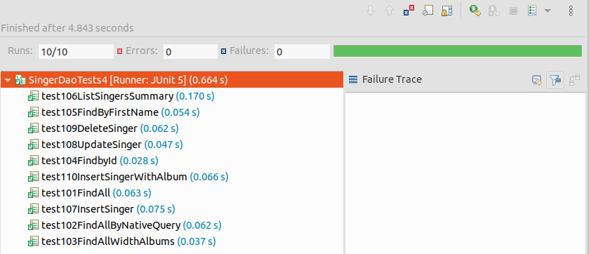

# JPA + atomikos JTA를 이용한 멀티 데이타소스 트랜잭션
기존 jpa-multi-datasource프로젝트에서 데이타소스를 atomikos JTA로 변경하여 2개의 데이타소스를 트랜잭션 처리한다.  

## Spring Boot Starter를 이용한 프로젝트 생성
Spring Boot -> Spring Starter Project로 생성한다.  

### 의존성 라이브러리
jpa 프로젝트 와 동일.  
소스 : [pom.xml](pom.xml)
```xml
        <dependency>
            <groupId>org.springframework.boot</groupId>
            <artifactId>spring-boot-starter-jta-atomikos</artifactId>
        </dependency>       
```
datasource-multi-mybatis 프로젝트에 atomikos를 추가한다.  
atomikos는 JTA(Java Transaction API)를 구현한 JTA구현체로 오픈소스로 제공한다.  

## 설정
### 어플리케이션 설정
소스 : [application.yml](src/main/resources/application.yml)  
```xml
spring.profiles.active: dev

spring:
  jta:
    enabled: true
    
#Multi DataSource 설정
db:
  db1: 
    datasource:
      unique-resource-name: dataSource1
      max-pool-size: 5
      min-pool-size: 1
      max-life-time: 20000
      borrow-connection-timeout: 10000
      xa-data-source-class-name: org.postgresql.xa.PGXADataSource
      xa-properties:
        user: linor
        password: linor1234
        URL: jdbc:postgresql://postgres:5432/spring?currentSchema=singer
  db2: 
    datasource:
      unique-resource-name: dataSource2
      max-pool-size: 5
      min-pool-size: 1
      max-life-time: 20000
      borrow-connection-timeout: 10000
      xa-data-source-class-name: org.postgresql.xa.PGXADataSource
      xa-properties:
        user: linor
        password: linor1234
        URL: jdbc:postgresql://postgres:5432/spring?currentSchema=public
```
spring.jta.enabled를 true로 설정하여 JTA를 사용하도록 한다.  
db1과 db2의 데이타소스를 atomikos에 맞게 설정한다.  
xa-data-source-class-name에 JTA용 데이타베이스 드라이버를 설정한다. 데이타베이스마다 JTA용 드라이버를 따로 제공한다.  
postgresql의 경우 org.postgresql.xa.PGXADataSource이다.  

### 1번 데이타소스 및 JPA EntityManager 설정
소스 : [Datasource1Config.java](src/main/java/com/linor/singer/config/Datasource1Config.java) 

#### 클래스 어노테이션 설정
```java
@Configuration
public class Datasource1Config {
```
@Configuration으로 설정클래스임을 정의한다.  

#### Datasource 빈 설정
```java
    @Bean
    @ConfigurationProperties("db.db1.datasource")
    @Primary
    public DataSource dataSource1() {
        return new AtomikosDataSourceBean();
    }
```
데이타소스 빈을 AtomikosDataSourceBean으로 생성한다.  

#### EntityManagerFactory 빈 설정
```java
	@Bean
	@Primary
	public LocalContainerEntityManagerFactoryBean entityManagerFactory1(
			EntityManagerFactoryBuilder builder,
			@Qualifier("dataSource1") DataSource dataSource) {
		Map<String, ?> jpaProperties = hibernateProperties();
		return builder
				.dataSource(dataSource)
				.jta(true)
				.packages("com.linor.singer.domain1")
				.persistenceUnit("db1")
				.properties(jpaProperties)
				.build();
	}
	private Map<String, ?> hibernateProperties() {
		
		Map<String, Object> hibernateProp = new HashMap<>();
		hibernateProp.put("hibernate.dialect", PostgreSQL10Dialect.class.getName());
		hibernateProp.put("hibernate.hbm2ddl.auto", "create");
		hibernateProp.put("hibernate.format_sql", "false");
		hibernateProp.put("hibernate.use_sql_comments", "false");
		hibernateProp.put("hibernate.show_sql", "true");
		hibernateProp.put("hibernate.physical_naming_strategy", CamelCaseToSnakeCaseNamingStrategy.class.getName());
		hibernateProp.put("hibernate.transaction.jta.platform", AtomikosJtaPlatform.class.getName());
		hibernateProp.put("javax.persistence.transactionType", "JTA");
		
		return hibernateProp;
	}
```
EntityManagerFactoryBuilder는 빌더클래스로 설정값을 설정한 다음 마지막에 build()로 EntityManagerFactory를 생성한다.
- dataSource()는 사용할 데이타소스를 선언한다.
- jta()로 true를 설정하여 jta를 사용하도록 한다.  
- packages()는 엔터티가 존재하는 패키지를 선언한다.  
- persistenceUnit()는 PersistentUnit명을 선언한다.  
- properties()는 하이버네이트 추가 설정사항을 선언한다. 

hibernateProperties()설정사항에서 JTA를 위한 3가지 설정사항을 추가한다.  
- hibernate.transaction.factory_class : org.hibernate.transaction.JTATransactionFactory
- hibernate.transaction.jta.platform : AtomikosJtaPlatform.class.getName()
- hibernate.transaction.coordinator_class : jta

### 2번 데이타소스 및 JPA EntityManager 설정
소스 : [Datasource2Config.java](src/main/java/com/linor/singer/config/Datasource2Config.java) 

## Domain 클래스 생성
기존 jpa 프로젝트의 엔터티를 엔터티1, 엔터티2로 만든다.    
### 1번 데이타소스용 
소스 : [Singer1.java](src/main/java/com/linor/singer/domain1/Singer1.java)  
소스 : [Album1.java](src/main/java/com/linor/singer/domain1/Album1.java)  
소스 : [Instrument1.java](src/main/java/com/linor/singer/domain1/Instrument1.java)  
소스 : [SingerSummary1.java](src/main/java/com/linor/singer/domain1/SingerSummary1.java)  

### 2번 데이타소스용 
소스 : [Singer2.java](src/main/java/com/linor/singer/domain2/Singer2.java)  
소스 : [Album2.java](src/main/java/com/linor/singer/domain2/Album2.java)  
소스 : [Instrument2.java](src/main/java/com/linor/singer/domain2/Instrument2.java)  
소스 : [SingerSummary2.java](src/main/java/com/linor/singer/domain1/SingerSummary2.java)  

## DAO인터페이스 생성
기존 jpa 프로젝트의 DAO인터페이스를 2개로 복사하여 만든다.      
### 1번 데이타소스용 
소스 : [SingerDao1.java](src/main/java/com/linor/singer/dao1/SingerDao1.java)  
### 2번 데이타소스용 
소스 : [SingerDao2.java](src/main/java/com/linor/singer/dao2/SingerDao2.java)  

## SingerDao인터페이스 구현
기존 jpa 프로젝트의 DAO인터페이스 구현을 2개로 복사하여 만든다.      
### 1번 데이타소스용 
소스 : [SingerDao1Impl.java](src/main/java/com/linor/singer/jpa1/SingerDao1Impl.java)  

### 2번 데이타소스용 
소스 : [SingerDao2Impl.java](src/main/java/com/linor/singer/jpa2/SingerDao2Impl.java)  

## 결과 테스트
Junit으로 SingerDaoTests를 실행한다.  
- 1번 데이타소스용 테스트 [SingerDaoTests1.java](src/test/java/com/linor/singer/SingerDaoTests1.java)  
- 2번 데이타소스용 테스트 [SingerDaoTests2.java](src/test/java/com/linor/singer/SingerDaoTests2.java)  
```java
@RunWith(SpringRunner.class)
@SpringBootTest
@Transactional
@Slf4j
public class SingerDaoTests2 {
```
jpa-multi-datasource에서 @Transactional에 명시적으로 등록했던 txManager2삭제한다.  
- 1,2번 둘 다 테스트 [SingerDaoTests3.java](src/test/java/com/linor/singer/SingerDaoTests3.java)  
```java
@RunWith(SpringRunner.class)
@SpringBootTest
@Transactional
@Slf4j
public class SingerDaoTests3 {
```

```java
	@Test
	@Transactional(value="txManager2", readOnly = true)
	public void test201FindAll(){
		log.info("테스트201");
		List<Singer2> singers = singerDao2.findAll();
		assertNotNull(singers);
		log.info("가수목록");
		listSingers2(singers);
		assertTrue(singers.size() == 3);
	}
```
2개의 데이타소스를 동시에 사용하는 경우 메서드 레벨에서 @Traunsactinal에 명시적으로 선언했던 txManager2를 제거한다.  
- 하나의 메서드 내에서 2개의 데이타소스 사용 [SingerDaoTests4.java](src/test/java/com/linor/singer/SingerDaoTests4.java)  
  
SingerDaoTests4를 JUnit으로 테스트하면 jpa-multi-datasource에서 발생했던 오류들이 나타나지 않고 성공적으로 수행된다.  

## 정리
JPA도 JTA를 이용하면 여러 데이타베이스를 하나의 트랜잭션으로 처리할 수 있다.    