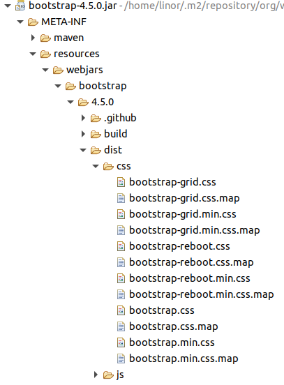
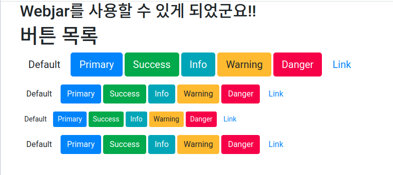

# Webjar 사용하기
Webjar는 프론트엔드에서 사용하는 Jquery 자바스크립트 라이브러리나, Bootstrap CSS프레임워크를 jar 패키지로 등록하여 사용할 수 있도록 한다.

## Spring Boot Starter를 이용한 프로젝트 생성
기존에 만든 02-01-mvc-static프로젝트를 복사하여  
02-02-mvc-webjar로 생성한다.

### 의존성 라이브러리
소스 : [pom.xml](pom.xml)
```xml
	<dependencies>
		<dependency>
			<groupId>org.springframework.boot</groupId>
			<artifactId>spring-boot-starter-web</artifactId>
		</dependency>
		<dependency>
			<groupId>org.springframework.boot</groupId>
			<artifactId>spring-boot-starter-test</artifactId>
			<scope>test</scope>
		</dependency>
		<dependency>
			<groupId>org.webjars</groupId>
			<artifactId>bootstrap</artifactId>
			<version>4.5.0</version>
		</dependency>
	</dependencies>
```
많이 사용하는 bootstrap CSS프레임워크를 추가한다. org.webjars에서 제공하는 bootstrap을 추가하면 알아서 bootstrap에서 필요로하는 jquery, popper.js를 같이 임포트한다.  

Maven Dependency의 bootstrap-4.5.0.jar파일을 열면 다음과 같은 구조로 되어 있다.
  

## html에서 webjar 사용
소스 : index.html(src/main/resources/public/index.html)
```html
	<link rel="stylesheet" href="/webjars/bootstrap/4.5.0/dist/css/bootstrap.css"/>
	<link rel="sytlesheet" href="/css/styles.css"/>	
	<script src="/webjars/jquery/3.5.1/dist/jquery.slim.min.js"></script>
	<script src="/webjars/popper.js/1.16.0/dist/umd/popper.min.js"></script>
	<script src="/webjars/bootstrap/4.5.0/dist/js/bootstrap.min.js"></script>
```
js나 css파일의 위치는 jar파일을 열었을 때  /META-INF/resources/의 하위 디렉토리부터 표시한다.  

## 결과 테스트
브라우저에서 다음 주소를 호출한다.  
http://localhost:8080  
  
"페이지 이동" 메뉴늘 클릭한다.  

  
bootstrap이 적용된 각종 버튼들을 확인할 수 있다.  
