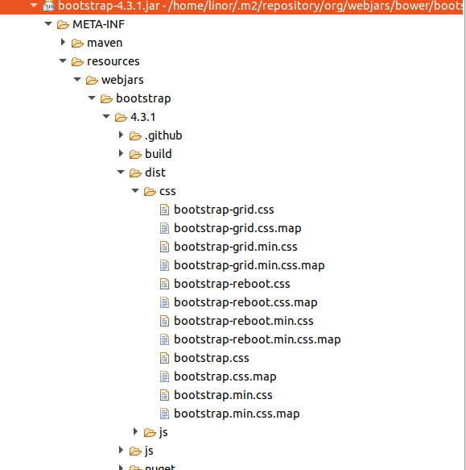

# Webjar 사용하기
Webjar는 프론트엔드에서 사용하는 Jquery 자바스크립트 라이브러리나, Bootstrap CSS프레임워크를 jar 패키지로 등록하여 사용할 수 있도록 한다.

## Spring Boot Starter를 이용한 프로젝트 생성
기존에 만든 02-01-mvc-static프로젝트를 복사하여  
02-02-mvc-webjar로 생성한다.

### 의존성 라이브러리
소스 : [pom.xml](pom.xml)
```xml
	<dependencies>
		<dependency>
			<groupId>org.springframework.boot</groupId>
			<artifactId>spring-boot-starter-web</artifactId>
		</dependency>
		<dependency>
			<groupId>org.springframework.boot</groupId>
			<artifactId>spring-boot-starter-test</artifactId>
			<scope>test</scope>
		</dependency>
		<dependency>
			<groupId>org.webjars.bower</groupId>
			<artifactId>bootstrap</artifactId>
			<version>4.3.1</version>
		</dependency>
		<dependency>
			<groupId>org.webjars.bower</groupId>
			<artifactId>jquery</artifactId>
			<version>3.4.1</version>
		</dependency>
		<dependency>
			<groupId>org.webjars.bower</groupId>
			<artifactId>popper.js</artifactId>
			<version>1.16.0</version>
		</dependency>
	</dependencies>
```
많이 사용하는 bootstrap CSS프레임워크와, jquery 자바스크립트 라이브러리, popper.js자바스크립트 라이브러리를 webjar로 추가한다.

  
Maven Dependency의 bootstrap-4.3.1.jar파일을 열면 위와 같은 구조로 되어 있다.


## html에서 webjar 사용
소스 : index.html(src/main/resources/public/index.html)
```html
<!DOCTYPE html>
<html>
<head>
	<meta charset="UTF-8">
	<title>홈화면</title>
	<link rel="stylesheet" href="/webjars/bootstrap/4.3.1/dist/css/bootstrap.css"/>
	<link rel="sytlesheet" href="/css/styles.css"/>	
	<script src="/webjars/jquery/3.4.1/dist/jquery.slim.min.js"></script>
	<script src="/webjars/popper.js/1.16.0/dist/umd/popper.min.js"></script>
	<script src="/webjars/bootstrap/4.3.1/dist/js/bootstrap.min.js"></script>
</head>
<body>
	<nav class="navbar fixed-top navbar-expand-lg navbar-dark bg-dark">
		<a href="#" class="navbar-brand">프로젝트 명</a>
		<button class="navbar-toggler" 
				type="button" 
				data-toggle="collapse" 
				data-target="#navbarNav" 
				aria-controls="navbarNav" 
				aria-expanded="false" 
				aria-label="Toggle navigation">
    		<span class="navbar-toggler-icon"></span>
  		</button>
		<div id="navbarNav" class="collapse navbar-collapse">
			<ul class="navbar-nav">
				<li class="nav-item active">
					<a href="#" class="nav-link">홈</a>
				</li>
				<li class="nav-item">
					<a href="#about" class="nav-link">소개</a>
				</li>
				<li class="nav-item">
					<a href="#contact" class="nav-link">연락처</a>
				</li>
				<li class="nav-item">
					<a href="/hello.html" class="nav-link">페이지 이동</a>
				</li>
			</ul>
		</div>
	</nav>
	<div class="container mt-2">
		<h2>환영합니다!!</h2>
		
	</div>
</body>
</html>
```
## 결과 테스트
브라우저에서 다음 주소를 호출한다.  
http://localhost:8080
 