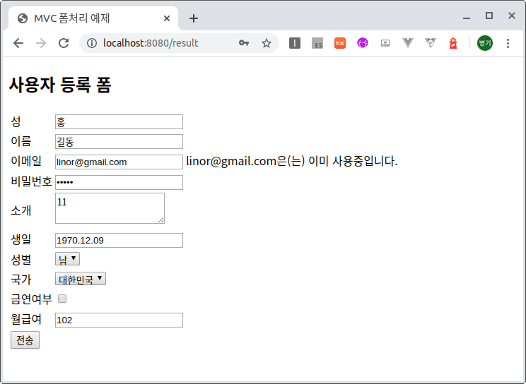

# Spring Boot에서 JSTL Form 유효성 체크
02-05-mvc-form프로젝트에서 처리했던 폼처리에 유효성(Validation) 체크를 추가해 본다.  

## Spring Boot Starter를 이용한 프로젝트 생성
프로젝트 생성은 02-05-mvc-form을 복사하여 진행한다.  

### 의존성 라이브러리
validation-api를 이용하여 유효성 체크를 하는데, 이 라이브러리는 spring-boot-starter-web에 포함되어 있다.

소스 : [pom.xml](pom.xml)
의존성 라이브러리는 다음과 같다.  
```xml
		<dependency>
			<groupId>org.springframework.boot</groupId>
			<artifactId>spring-boot-starter-web</artifactId>
		</dependency>
		<dependency>
			<groupId>org.springframework.boot</groupId>
			<artifactId>spring-boot-starter-validation</artifactId>
		</dependency>
		<dependency>
			<groupId>org.springframework.boot</groupId>
			<artifactId>spring-boot-devtools</artifactId>
			<scope>runtime</scope>
		</dependency>
		<dependency>
			<groupId>org.projectlombok</groupId>
			<artifactId>lombok</artifactId>
			<optional>true</optional>
		</dependency>
		<dependency>
			<groupId>org.springframework.boot</groupId>
			<artifactId>spring-boot-starter-test</artifactId>
			<scope>test</scope>
		</dependency>
 		<!-- JSTL for JSP -->
		<dependency>
			<groupId>javax.servlet</groupId>
			<artifactId>jstl</artifactId>
		</dependency>
		<!-- Need this to compile JSP -->
		<dependency>
			<groupId>org.apache.tomcat.embed</groupId>
			<artifactId>tomcat-embed-jasper</artifactId>
			<scope>provided</scope>
		</dependency>
		<!-- Optional for static content. bootstrap CSS -->
		<dependency>
			<groupId>org.webjars</groupId>
			<artifactId>bootstrap</artifactId>
			<version>4.5.0</version>
		</dependency>
```

## 설정
### 어플리케이션 설정
소스 : [application.yml](src/main/resources/application.yml)  
```yml
spring:
  mvc:
    view:
      prefix: /WEB-INF/jsp/
      suffix: .jsp
  messages:
    basename: messages
    cache-duration: -1
    encoding: UTF-8
    fallback-to-system-locale: true
```
사용포트는 설정하지 않으면 디폴트가 8080포트를 사용한다.  
jsp파일의 위치를 설정하기 위해 sprint.mvc.view.prefix와 suffix를 설정한다.  
spring.messages는 메시지 Properties파일을 설정하기 위해 사용한다.  
-  basename : Properties파일명을 설정한다. messages.properties파일로 설정하기 위해 messages로 입력함.
-  cache-duraton : -1로 입력하면 시작시 메모리에 올려서 서버가 죽을 때까지 사용한다.

### 메시지 프로퍼티파일 설정
설정파일에서 설정한 메시지 내용은 다음과 같다.  
소스 : [messages.properties](src/main/resources/messages.properties)

```properties
Pattern.user.password=비밀번호는 대소문자를 포함한 4 이상 15자 이하이어야 합니다.
error.name=이름은 {min}에서 {max}개의 문자열로 작성합니다.
error.lastName=성은 필수입력입니다.
error.email=정확한 이메일 양식으로 등록하세요.
```
시스템에서 사용할 메시지를 등록한다.

#### Validation 메시지 소스 설정
소스 : [WebConfig.java](src/main/java/com/linor/singer/config/WebConfig.java)  
```java
@Configuration
@RequiredArgsConstructor
public class WebConfig implements WebMvcConfigurer{
	private final MessageSource messageSource;
	@Override
	public Validator getValidator() {
		LocalValidatorFactoryBean factory = new LocalValidatorFactoryBean();
		factory.setValidationMessageSource(messageSource);
		return factory;
	}
}
```
Validation에서 사용할 메시지 소스를 지정하기 위해 WebMvcConfigurer를 상속받아 WebConfig설정 클래스를 생성한다.    
메시지 소스는 applicaition.yml에서 설정한 messages.properties파일이 설정된다.  
위 설정 클래스를 생성하지 않으면 디폴트로 /ValidationMessages.properties를 사용한다.  

### 폼데이터 유효성 체크를 위한 모델 클래스 수정
소스: [User.java](src/main/java/com/linor/singer/model/User.java)   

```java
@Data
public class User {
	@Size(min = 2, max = 10, message = "{error.name}")
	private String name;
	
	@NotEmpty(message = "{error.lastName}")
	private String lastName;
	
	@Email(message = "{error.email}")
	private String email;
	
	@Pattern(regexp = "^[a-zA-Z]\\w{3,14}$")
	private String password;
	
	private String detail;
	
	@Past
	@DateTimeFormat(pattern="yyyy.MM.dd")
	private LocalDate birthDate;
	
	private Gender gender;
	private String country;
	private boolean nonSmoking;
	
	@NumberFormat(pattern="#,##0")
	@Min(value = 100)
	private long salary;
}
```
유효성 체크를 위해 Validation어노테이션들을 추가한다.  
-  @Size(min = 2, max = 10, message = "{error.name}") : 최소 2문자, 최해 10문자로 제한하고 체크에서 벗어 나는 경우 messsages.properties파일의 error.name메시지를 메시지로 제공한다.  
-  @NotEmpty(message = "{error.lastName}") : 필수 입력 설정으로 값이 없을 경우 error.lastName메시지를 제공한다.
-  @Email(message = "{error.email}") : 데이타가 이메일 패턴에 맞는지 체크한다.
-  @Pattern(regexp = "^[a-zA-Z]\\w{3,14}$") : 정규 표현식에 맞는지 체크
-  @Past : 날짜관련 타입이 과거인지 체크
-  @Min(value = 100) : 최소값이 설정된 값 이상인지 체크
### 컨트롤러 생성
소스 :[UserController.java](src/main/java/com/linor/singer/controller/UserController.java)  

```java
@Controller
public class UserController {
	private static final String[] countries =
		{"대한민국", "터어키", "미국", "일본"};
	
	@RequestMapping(value="/form")
	public String user(Model model) {
		model.addAttribute("user", new User());
		model.addAttribute("genders", Gender.values());
		model.addAttribute("countries", countries);
		return "userForm";
	}
	
	@RequestMapping(value = "/result")
	public String processUser(@Valid User user, BindingResult result, Model model) {
		
		if(result.hasErrors()) {
			model.addAttribute("user", user);
			model.addAttribute("genders", Gender.values());
			model.addAttribute("countries", countries);
			return "userForm";
		}else {
			model.addAttribute("u", user);
			return "userResult";
		}
	}
}
```
폼 입력값을 처리하는 processUser메서드에서 유효성 체크를 위해 @Valid어노테이션을 추가한다.  
유효성 체크 결과는 BindingResult result파라미터에서 result.hasErrors()가 True이면 유효성 체크에서 오류가 발생한 경우이므로 모델에 입력받은 값을 다시 등록하여 오류 메시지와 다시 폼에서 입력받을 수 있도록 userForm.jsp뷰를 호출한다.  
오류가 없으면 결과를 보기 위하여 userResult.jsp뷰를 호출한다.   
 
### 입력뷰 JSP 
소스 [userForm.jsp](src/main/webapp/WEB-INF/jsp/userForm.jsp)
```jsp
<%@ page language="java" contentType="text/html; charset=UTF-8"
    pageEncoding="UTF-8"%>
<%@ taglib uri="http://www.springframework.org/tags/form" prefix="form" %>
<!DOCTYPE html>
<html>
<head>
<meta charset="UTF-8">
<title>MVC 폼처리 예제</title>
<style type="text/css">
	.formFieldError {background-color: #ffffcc;}
</style>
</head>
<body>
<h2>사용자 등록 폼</h2>
<form:form modelAttribute="user" action="result">
	<table>
		<tr>
			<td><form:label path="lastName">성</form:label></td>
			<td><form:input path="lastName" cssErrorClass="formFieldError"/></td>
			<td><form:errors path="lastName"/></td>
		</tr>
		<tr>
			<td><form:label path="name">이름</form:label></td>
			<td><form:input path="name" cssErrorClass="formFieldError"/></td>
			<td><form:errors path="name"/></td>
		</tr>
		<tr>
			<td><form:label path="email">이메일</form:label></td>
			<td><form:input path="email"/></td>
			<td><form:errors path="email"/></td>
		</tr>
		<tr>
			<td><form:label path="password">비밀번호</form:label></td>
			<td><form:password path="password" cssErrorClass="formFieldError"/></td>
			<td><form:errors path="password"/></td>
		</tr>
		<tr>
			<td><form:label path="detail">소개</form:label></td>
			<td colspan="2"><form:textarea path="detail"/></td>
		</tr>
		<tr>
			<td><form:label path="birthDate">생일</form:label></td>
			<td><form:input path="birthDate" cssErrorClass="formFieldError"/></td>
			<td><form:errors path="birthDate"/></td>
		</tr>
		<tr>
			<td><form:label path="gender">성별</form:label></td>
			<td colspan="2"><form:select path="gender" items="${genders}" itemName="key" itemLabel="value"/></td>
		</tr>
		<tr>
			<td><form:label path="country">국가</form:label></td>
			<td colspan="2"><form:select path="country" items="${countries}"/></td>
		</tr>
		<tr>
			<td><form:label path="nonSmoking">금연여부</form:label></td>
			<td colspan="2"><form:checkbox path="nonSmoking"/></td>
		</tr>
		<tr>
			<td><form:label path="salary">월급여</form:label></td>
			<td><form:input path="salary"/></td>
			<td><form:errors path="salary"/></td>
		</tr>
		<tr>
			<td colspan="3"><input type="submit" value="전송"/>
		</tr>
	</table>
</form:form>	
</body>
</html>
```

```jsp
<%@ taglib uri="http://www.springframework.org/tags/form" prefix="form" %>
```
스프링에서 제공하는 form태그라이브러리를 사용하기 위해 선언한다.

```jsp
<form:form modelAttribute="user" action="result">
```
form:form태그는 스프링의 form태그라이브러리로 modelAttribute에 user를 선언하여 컨트롤러에서 모델에 설정한 user를 사용하도록 한다.  

```jsp
			<td><form:label path="lastName">성</form:label></td>
			<td><form:input path="lastName" cssErrorClass="formFieldError"/></td>
			<td><form:errors path="lastName"/></td>
```
form:input의 path는 user의 속성을(lastName)을 지정한다.  
cssErrorClass는 요효성 체크 후 오류인 경우 css클래스를 지정한다.  
<form:errors path="lastName"/>는 lastName유효성에 오류가 발생한 경우 메시지를 출력한다.  

## 결과 테스트
브라우저에서 다음 주소를 호출한다.  
http://localhost:8080/form

## CustomValidation 구현
org.springframework.validation.Validator를 이용하여 복잡한 유효성 체크를 구현할 수 있다.  
입력한 email이 linor@gmail.com이면 이미 등록한 이메일 임을 알리는 오류표시를 해보자.  
소스 [UserValidator.java](src/main/java/com/linor/singer/validators/UserValidator.java)
```java
@Component
public class UserValidator implements Validator {

	@Override
	public boolean supports(Class<?> clazz) {
		return User.class.isAssignableFrom(clazz);
	}

	@Override
	public void validate(Object target, Errors errors) {
		User user = (User)target;
		String email = user.getEmail();
		if ("linor@gmail.com".equals(email)) {
			errors.rejectValue("email",
					"email.exists",
					new Object[] {email},
					email + "은(는) 이미 사용중입니다.");
		}
	}
}
```

이제 컨트롤러에서 User Validator를 사용한다.
소스 [UserController.java](src/main/java/com/linor/singer/controller/UserController.java)

```java
	@Autowired
	private UserValidator userValidator;
```
UserValidator를 맴버번수로 등록한다.

```java
	@RequestMapping(value = "/result")
	public String processUser(@Valid User user, BindingResult result, Model model) {
		userValidator.validate(user, result);
		
		if(result.hasErrors()) {
			model.addAttribute("user", user);
			model.addAttribute("genders", Gender.values());
			model.addAttribute("countries", countries);
			return "userForm";
		}else {
			model.addAttribute("u", user);
			return "userResult";
		}
	}
```
userValidator.validate(user, result);로 유효성체크한다.  


