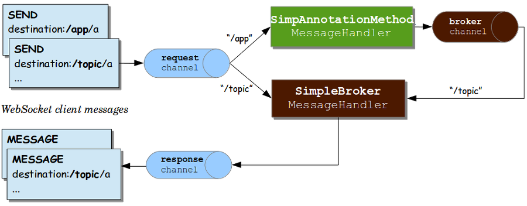

# WebSocket
WebSocket이란 HTTP 환경에서 전이중 통신(full duplex, 2-way communication)을 지원하기 위한 프로토콜로, RFC 6455에 정의되어 있다.  
HTTP 프로토콜에서 Handshaking을 완료한 후, HTTP로 동작을 하지만, HTTP와는 다른 방식으로 통신을 한다.  
WebSocket은 클라이언트 또는 서버가 연결을 종료할 때까지 연결을 유지한다.  
전형적인 사례로 여러 사용자가 같이 대화하는 채팅 앱에 사용될 수 있다.  

## 설정
### 메이븐 의존성 
Spring Boot Starter에서 WebSocket, Lombok, SpringBoot DevTools를 추가하여 프로젝트를 생성한다.  
소스 : [pom.xml](pom.xml)  
```xml
<dependencies>
	<dependency>
		<groupId>org.springframework.boot</groupId>
		<artifactId>spring-boot-starter-websocket</artifactId>
	</dependency>
	<dependency>
		<groupId>org.webjars</groupId>
		<artifactId>sockjs-client</artifactId>
		<version>${sockjs-client.version}</version>
	</dependency>
	<dependency>
		<groupId>org.webjars</groupId>
		<artifactId>stomp-websocket</artifactId>
		<version>${stomp-websocket.version}</version>
	</dependency>
	<dependency>
		<groupId>org.springframework.boot</groupId>
		<artifactId>spring-boot-devtools</artifactId>
		<scope>runtime</scope>
		<optional>true</optional>
	</dependency>
	<dependency>
		<groupId>org.projectlombok</groupId>
		<artifactId>lombok</artifactId>
		<optional>true</optional>
	</dependency>
	<dependency>
		<groupId>org.springframework.boot</groupId>
		<artifactId>spring-boot-starter-test</artifactId>
		<scope>test</scope>
	</dependency>
</dependencies>
```
pom.xml을 열어서 위와같이 자바스크립트 라이브러리를 사용하기 위해 sockjs-client와 stomp-websocket webjar를 추가한다.  

### 스프링에서 WebSocket 활성화
WebSocket을 사용하기 위해서 WebSocketMessageBrokerConfigurer인터페이스구현체로 설정 클래스를 생성한다.  
설정 클래스에 @EnableWebSocketMessageBroker어노테이션을 추가한다.  
소스 : [WebSocketConfig.java](src/main/java/com/linor/app/config/WebSocketConfig.java)  
```java
@Configuration
@EnableWebSocketMessageBroker
public class WebSocketConfig implements WebSocketMessageBrokerConfigurer {
	public void configureMessageBroker(MessageBrokerRegistry registry) {
		//in-memory message-broker, topic에 대한 prefix 설정
		registry.enableSimpleBroker("/topic");
		
		//메세지를 수신하는 handler의 메세지 prefix 설정 
		registry.setApplicationDestinationPrefixes("/app");
	}
	public void registerStompEndpoints(StompEndpointRegistry registry) {
		registry.addEndpoint("/chat")
			.setAllowedOrigins("*")
			.withSockJS();
	}
}
``` 
configureMessageBroker메서드는 메시지 브로커를 설정하는데 사용한다. 이 메서드에서 "/topic"으로 시작하는 목적지 클라이언트에 메시지를 전달하는 내장 메모리 메시지 브로커를활성화 한다.  
서버와 연결된 클라이언트는 "/app"으로 시작하는 path로 메시지를 전달하기 위해 registry.setApplicationDestinationPrefixes메서드를 설정한다.  

registerStompEndpoints메서드에서 "/chat"엔드포인트를 등록하여 Spring이 STOMP지원을 가능하게 한다.
또한 WebSocket을 사용할 수없는 경우 대체 메시징 옵션을 사용할 수 있도록 SockJS 대체 옵션도 활성화한다. WebSocket이 아직 모든 브라우저에서 지원되는 것은 아니며 제한적인 네트워크 프록시에 의해 금지 될 수 있으므로 유용하다.(이 프로젝트에서 사용하는 엔드포인트임)  

#### Stomp 프로토콜을 사용하여  메세징 처리
STOMP 프로토콜은 (simple text oriented messaging protocol)의 약자이며, 텍스트 기반의 프로토콜이다.

스프링 문서에 Websocket과 함께 STOMP 프로토콜을 사용하는 방법은 위와 같은데, Spring 내부의 In Memory Broker를 통해 메세지를 처리한다.  
도식화 된 그림의 키포인트는 3가지이다.  
- Receive Client  
- Send Client  
- Brkoer  

Receive Client 
- 메세지를 받기 위해 특정 토픽이 사전에 서버에 subscribe 되어야 한다.  

Send Client  
- 서버와 연결된 클라이언트는 특정 path로 ex) /app/message  전달한다.  

Broker  
- 메세지 브로커는 Kafka, RabbitMQ, ActiveMQ 등의 오픈소스들 처럼  MQ 이며, pub/sub 모델을 따른다. 토픽에 따라 메세지를 전달해야 하는 사용자를 구분한다.
- 연결된 클라이언트의 세션을 관리한다.
- 특정 토픽과 메세지를 Mapping 하여, 토픽을 구독하는 세션에 존재하는 클라이언트에게 메세지를 전달한다.  


### 메시지 모델 생성
JSON객체인 송신자명과 텍스트내용으로 구성된 STOMP메시지를 접점(EndPoint)에서 수신하는 Message와, 메시지에 전송시간을 추가한 OutputMessage모델 클래스를 생성한다.    
소스 : [Message.java](src/main/java/com/linor/app/model/Message.java)  
```java
@Data
public class Message {
	private String from;
	private String text;
}
```

소스 : [OutputMessage.java](src/main/java/com/linor/app/model/OutputMessage.java)  
```java
@Data
@AllArgsConstructor
@NoArgsConstructor
@Builder
public class OutputMessage {
	private String from;
	private String text;
	@JsonFormat(pattern = "yyyy-MM-dd HH:mm:ss SSS", timezone = "Asia/Seoul")
	private LocalDateTime time;
}
```

### 메시지 처리 컨트롤러 생성
앞에서 STOMP메시지를 처리할 수 있도록 접점(Endpoint)을 설정하여서, 컨트롤러 메서드에서 @MessageMapping어노테이션을 선언하여 메시지 작업을 할 수 있게 되었다.   
소스 : [WebSocketController.java](src/main/java/com/linor/app/controller/WebSocketController.java)  
```java
@RestController
public class WebSocketController {
	@MessageMapping("/chatting")
	@SendTo("/topic/messages")
	public OutputMessage send(Message message) throws Exception{
		return OutputMessage.builder()
				.from(message.getFrom())
				.text(message.getText())
				.time(LocalDateTime.now())
				.build();
	}
}
```
설정에서 setApplicationDestinationPrefix를 /app로 설정했기 때문에, 접점(Endpoint)으로 메세지를 보내려면 /app/chatting으로 메세지를 보내고, MessageHandler는 메세지를 수신한다.  
MessageHandler는 @MessageMapping에 "/chatting"을 선언한 컨트롤러의 메서드(send)를 호출한다. 컨트롤러의 메서드가 메세지를 수신하면, @SendTo를 통해 특정 토픽("/topic/messages")을 구독하는 클라이언트에게 결과메세지(OutputMessage)를 보낸다.  

###  브라우저 클라이언트 생성
백엔드 개발을 완료하였으므로 프론트엔드 프로그램을 개발한다.  
sockjs-client 라이브러리를 이용하여 개발한 메시징 시스템과 통신하는 간단한 html페이지를 생성한다.  

소스 :[index.html](src/main/resources/public/index.html)  
```html
<html>
<head>
<title>Chat WebSocket</title>
<script src="/webjars/stomp-websocket/2.3.3-1/stomp.js"></script>
<script type="text/javascript">
	var stompClient = null;
	function setConnected(connected) {
		document.getElementById('connect').disabled = connected;
		document.getElementById('disconnect').disabled = !connected;
		document.getElementById('conversationDiv').style.visibility = connected ? 'visible'	: 'hidden';
		document.getElementById('response').innerHTML = '';
	}
	function connect() {
		var socket = new WebSocket('ws://localhost:8080/chat');
		stompClient = Stomp.over(socket);
		stompClient.connect({}, function(frame) {
			setConnected(true);
			console.log('Connected: ' + frame);
			stompClient.subscribe('/topic/messages', function(messageOutput) {
				showMessageOutput(JSON.parse(messageOutput.body));
			});
		});
	}
	function disconnect() {
		if (stompClient != null) {
			stompClient.disconnect();
		}
		setConnected(false);
		console.log("Disconnected");
	}
	function sendMessage() {
		var from = document.getElementById('from').value;
		var text = document.getElementById('text').value;
		stompClient.send("/app/chatting", {}, JSON.stringify({
			'from' : from,
			'text' : text
		}));
	}
	function showMessageOutput(messageOutput) {
		var response = document.getElementById('response');
		var p = document.createElement('p');
		p.style.wordWrap = 'break-word';
		p.appendChild(document.createTextNode(messageOutput.from + ": "
				+ messageOutput.text + " (" + messageOutput.time + ")"));
		response.appendChild(p);
	}
</script>
</head>
<body onload="disconnect()">
	<div>
		<div>
			<input type="text" id="from" placeholder="Choose a nickname" />
		</div>
		<br />
		<div>
			<button id="connect" onclick="connect();">Connect</button>
			<button id="disconnect" disabled="disabled" onclick="disconnect();">
				Disconnect</button>
		</div>
		<br />
		<div id="conversationDiv">
			<input type="text" id="text" placeholder="Write a message..." />
			<button id="sendMessage" onclick="sendMessage();">Send</button>
			<p id="response"></p>
		</div>
	</div>
</body>
</html>
```
sockjs와 stomp자바스크립트 클라이언트 라이브러리를 가져온다.  
주요 함수들
- connect(): 접점(Endpoint)와 통신을 연결하고, "/topic/messages"토픽을 구독하여 메시지가 수신되면 화면에 보여준다.  
- sendMessage(): "/app/chatting" 접점(Endpoint)으로 STOMP메시지를 전송한다.  
- disconnect(): 통신을 종료한다.  

# 테스트 방법
스프링 부트 실행 후  
Websocket방식 http://localhost:8080/  
SockJS방식  http://localhost:8080/index2.html  

### 출처
https://supawer0728.github.io/2018/03/30/spring-websocket/  
https://swiftymind.tistory.com/105  
https://www.baeldung.com/websockets-spring  
