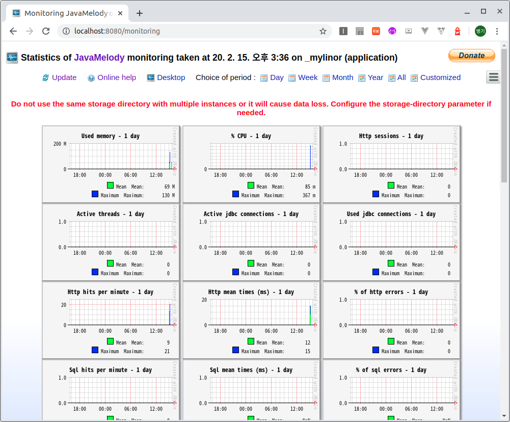

# 모니터링 툴 JavaMelody
JavaMelody는 자바기반 웹시스템을 모니터링하는 툴이다.  
모니터링 내역
-  전체 실행 수, 평균 실행 시간, CPU 시간 및 오류 백분율을 나타내는 요약
-  평균 시간이 구성 가능한 임계 값을 초과 할 때 요청에 소요 된 시간의 백분율
-  실행 횟수, 평균 실행 시간, 평균 CPU 시간, 오류 비율 및 시간 경과에 따른 실행 시간의 진화 차트와 함께 동적 매개 변수없이 집계 된 전체 요청 목록
-  각 HTTP 요청은 흐름 응답의 크기, 평균 SQL 실행 횟수 및 평균 SQL 시간

기존 02-01-mvc-static프로젝트를 복사하여 다음 내용을 수정한다.  
## Spring Boot Starter를 이용한 프로젝트 생성
### 의존성 라이브러리
소스 : [pom.xml](pom.xml)
```xml
	<dependencies>
...
		<dependency>
			<groupId>net.bull.javamelody</groupId>
			<artifactId>javamelody-spring-boot-starter</artifactId>
			<version>1.81.0</version>
		</dependency>
	</dependencies>
```
의존성 라이브러리에 javamelody-spring-boot-starter를 추가하여 JavaMelody라이브러리를 추가한다.

## JavaMelody 설정
소스 : [WebMvcConfig.java](src/main/java/com/linor/singer/config/WebMvcConfig.java)
```java
@Configuration
public class WebMvcConfig implements WebMvcConfigurer {

	@Bean(name = "javamelodyFilter")
	public FilterRegistrationBean<MonitoringFilter> javamelodyFilterBean(){
		FilterRegistrationBean<MonitoringFilter> registration =
				new FilterRegistrationBean<MonitoringFilter>();
		registration.setFilter(new MonitoringFilter());
		registration.addUrlPatterns("/*");
		registration.setName("javamelodyFilter");
		registration.setAsyncSupported(true);
		registration.setDispatcherTypes(DispatcherType.REQUEST, DispatcherType.ASYNC);
		
		return registration;
	}
	
	@Bean(name = "javamelodySessionListener")
	public ServletListenerRegistrationBean<SessionListener> sessionListener(){
		return new ServletListenerRegistrationBean<SessionListener>(new SessionListener());
	}
}
```
JavaMelody 모니터링 툴이 정보를 수집할 수 있도록 Filter와 ServletListener에 등록한다.

## 결과 테스트
브라우저에서 다음 주소를 호출한다.  
https://localhost:8080/monitoring
 
결과화면은 다음과 같다.


 