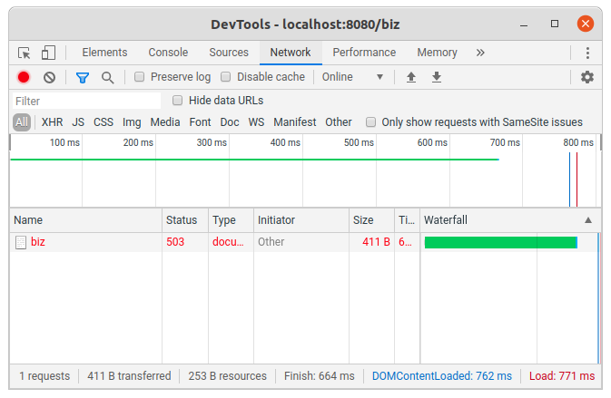

# Spring Boot MVC에서 에러 처리하기
Spring Boot MVC에서 Exception을 처리하는 방법은 보통 3가지 정도가 있다.
-  WebMvcConfigurer인터페이스를 상속받아 ExceptionResolver를 구현
-  Controller에 ExceptionHandler 생성
-  Exception을 처리하는 ControllerAdvice 클래스 생성

## Spring Boot Starter를 이용한 프로젝트 생성
이 프로젝트는 mvc-jstl을 복사하여 mvc-error-handling프로젝트를 생성한다.

## 1. SimpleMappingExceptionsResolver를 이용한 처리
소스 : [WebMvcConfig.java](src/main/java/com/linor/singer/config/WebMvcConfig.java)
```java
@Configuration
@EnableWebMvc
public class WebMvcConfig implements WebMvcConfigurer {
	@Bean
	public SimpleMappingExceptionResolver simpleMappingExceptionResolver() {
		SimpleMappingExceptionResolver exceptionResolver = new SimpleMappingExceptionResolver();
		Properties mappings = new Properties();
		mappings.setProperty("DataAccessException", "dbError");
		mappings.setProperty("BizException", "bizError");
		mappings.setProperty("RuntimeException", "runError");
		mappings.setProperty("ResourceNotFoundException", "404Error");
	
		exceptionResolver.setExceptionMappings(mappings);
		exceptionResolver.setDefaultErrorView("customError");
		return exceptionResolver;
	}
    @Bean
    public ViewResolver viewResolver () {
        InternalResourceViewResolver viewResolver =
                  new InternalResourceViewResolver();
        viewResolver.setPrefix("/WEB-INF/jsp/");
        viewResolver.setSuffix(".jsp");
        return viewResolver;
    }
}
```
SimpleMappingExceptionResolver빈을 등록하여 에러 처리하는 방법이다.  
DataAccessException이 발생하면 dbError.jsp를 호출하고, RuntimeException이 발생하면 runError.jsp페이지를 호출하도록 한다.  
SimpleMappingExceptionResolver빈을 등록하면 application.yml에 선언한 spring.mvc.view가 처리되지 않아(springboot 2.3.0버전에서 테스트) ViewResolver빈을 추가로 등록한다.  

## 2. Controller에서 @ExceptionHandler를 이용한 처리
두 번째 방법은 컨트롤러에서 @ExceptionHandler를 이용하여 생성한다.  
소스 : [SingerController.java](src/main/java/com/linor/singer/exception/SingerController.java)
```java
@Controller
public class SingerController {
...
	
	@ExceptionHandler(DataAccessException.class)
	@ResponseStatus(HttpStatus.SERVICE_UNAVAILABLE)
	public String handleDataAccessException(DataAccessException e, Model model) {
		model.addAttribute("exception", e);
		return "dbError";
	}

	@ExceptionHandler(BizException.class)
	@ResponseStatus(HttpStatus.SERVICE_UNAVAILABLE)
	public String handleBizException(BizException e, Model model) {
		model.addAttribute("exception", e);
		return "bizError";
	}

	@ExceptionHandler(RuntimeException.class)
	@ResponseStatus(HttpStatus.INTERNAL_SERVER_ERROR)
	public String handleRuntimeException(RuntimeException e, Model model) {
		model.addAttribute("exception", e);
		return "runError";
	}

	@ExceptionHandler(ResourceNotFoundException.class)
	@ResponseStatus(HttpStatus.NOT_FOUND)
	public String handleResourceNotFoundException(ResourceNotFoundException e, Model model) {
		model.addAttribute("exception", e);
		return "404Error";
	}

	@ExceptionHandler(Exception.class)
	@ResponseStatus(HttpStatus.INTERNAL_SERVER_ERROR)
	public String handleException(Exception e, Model model) {
		model.addAttribute("exception", e);
		return "customError";
	}
}
```
@ExcptionHandler를 이용하면 @ResponseStatus를 이용하여 Http Status Code를 추가로 선언할 수 있다.  
예를 들어 BizException이 발생하면 handleBizException메서드가 처리되어 모델에 exception값을 추가하여 bizError.jsp로 이동한다. 이때 Http 상태 코드를 SERVICE_UNAVAILABLE(503)으로 리턴한다.  
브라우저에서 개발자 도구를 띄운 다음 [http://localhost:8080/biz](http://localhost:8080/biz)을 호출하면 개발자 도구의 Network탭에서 다음과 같이 상태코드를 확인할 수 있다.  

 
## 3. ControllerAdvice 클래스 생성
컨트롤러에 ExceptionHandler를 처리하는 메서드로 구현하면 컨트롤러 내에서만 에러처리를 한다.  
시스템 전체적으로 사용할 수 있도록 하기 위해 ControllerAdvice클래스를 생성한다.  
소스 : [GlobalExceptionHandler.java](src/main/java/com/linor/singer/advice/GlobalExceptionHandler.java)
```java
@ControllerAdvice
public class GlobalExceptionHandler {

	@ExceptionHandler(DataAccessException.class)
	@ResponseStatus(HttpStatus.SERVICE_UNAVAILABLE)
	public String handleDataAccessException(DataAccessException e, Model model) {
		model.addAttribute("exception", e);
		return "dbError";
	}

	@ExceptionHandler(BizException.class)
	@ResponseStatus(HttpStatus.SERVICE_UNAVAILABLE)
	public String handleBizException(BizException e, Model model) {
		model.addAttribute("exception", e);
		return "bizError";
	}

	@ExceptionHandler(RuntimeException.class)
	@ResponseStatus(HttpStatus.INTERNAL_SERVER_ERROR)
	public String handleRuntimeException(RuntimeException e, Model model) {
		model.addAttribute("exception", e);
		return "runError";
	}

	@ExceptionHandler(ResourceNotFoundException.class)
	@ResponseStatus(HttpStatus.NOT_FOUND)
	public String handleResourceNotFoundException(ResourceNotFoundException e, Model model) {
		model.addAttribute("exception", e);
		return "404Error";
	}

	@ExceptionHandler(Exception.class)
	@ResponseStatus(HttpStatus.INTERNAL_SERVER_ERROR)
	public String handleException(Exception e, Model model) {
		model.addAttribute("exception", e);
		return "customError";
	}
}
```

 