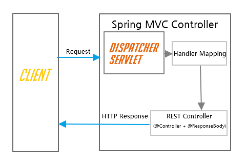
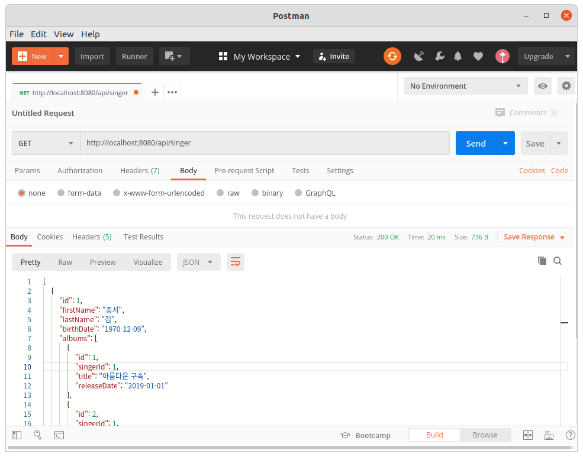

# Spring Rest

## REST 개요
REpresentational State Transfer의 약자다.  
이것은 장비간 통신을 위해 CORBA, RPC, SOAP등의 복잡한 방법을 사용하는 대신, 간단하게 HTTP를 이용하는 것이 목적이다.  
REST는 자원 지향 구조(Resource Oriented Architecture)로 웹 사이트의 이미지, 텍스트, DB 내용 등의 모든 자원에 고유한 URI를 부여한다.  
이 용어는 로이 필딩(Roy Fielding)의 2000년 박사학위 논문에서 소개되었다. (필등은 HTTP의 주요 저자중 한사람)  
엄격한 의미로 REST는 네트워크 아키텍처 원리모음 이다.  
네트워크 아키텍처 원리란 자원을 정의하고 자원에 대한 주소를 지정하는 방법 전반을 말한다.  
### CRUD
- Create : 생성(POST)
- Read : 조회(GET)
- Update : 수정(PUT)
- Delete : 삭제(DELETE)
위의 각 기능의 앞글자를 따서 위와같은 기능을 하는 것들을 CRUD라고 한다.  
이 기능에 대응하는 HTTP 메소드는 괄호안의 POST, GET, PUT, DELETE 이다.  

동일한 URL일 경우에도 메서드마다 기능이 다르게 이용 된다.  
- POST : http://localhost/api/user/홍길동
홍길동의 user정보를 생성한다.  
- PUT : http://localhost/api/user/홍길동
홍길동의 user정보를 수정한다.  
- GET : http://localhost/api/user/홍길동
홍길동의 user정보를 가져온다.  
- DELETE : http://localhost/api/user/홍길동
홍길동의 user정보를 제거한다.  

위와 같이 REST API 서버에서는 동일한 URL의 경우에도 메서드에 따른 각각의 비즈니스 로직을 처리한다.  

### URL에 동사보다는 명사를 사용
예를 들면 user를 추가하거나 가져오는 api에 대해서  
- GET /getUser/홍길동  
- POST /setUser/홍길동  
위와같이 사용하는걸 동사를 사용한다고 볼 수 있다.  
하지만 위에 배운것과 같이 메서드의 뜻을 이해 했다면 동사를 붙여서 url을 여러 개로 분리할 필요 없이 통일해서 사용할 수 있다.  
메서드가 동사의 역할을 하기 때문이다. 

위의 예제를 아래와 같이 수정할 수 있다.
- GET /user/홍길동
- POST /user/홍길동  
GET메서드는 get을 의미하고, POST 메서드는 생성을 의미한다.  
PUT과 DELETE도 마찬가지로 동작한다.  
이로써 우리는 통일된 URL을 사용할 수 있다.  

### 6가지를 충족하는 아키텍처 스타일
- Client-Server  
REST서버는 API를 제공한다.  
하나 혹은 여러 클라이언트에서 하나의 REST API를 이용할 수 있다.  
REST 서버에서 비즈니스 로직 처리 및 저장을 책임진다.  
클라이언트의 경우 사용자 인증이나 컨택스트(세션, 로그인 정보) 등을 직접 관리하고 책임지는 구조로 REST 서버와 역할이 나뉘어 지고 있다.  

- Stateless  
무상태성이라고도 한다.  
상태 정보를 저장하지 않고 각 API서버는 들어오는 요청만을 들어오는 메시지로만 처리한다.  
세션과 같은 컨텍스트 정보를 신경쓸 필요가 없기 때문에 구현이 단순해진다.  

- Cache  
캐쉬를 사용할 수 있다.  
HTTP 프로토콜 표준에서 사용하는 Last-Modified태그나 E-Tag를 이용하면 구현할 수 있다.  
캐쉬를 사용하게 되면 응답시간 뿐 아니라 REST 서버 트랜잭션이 발생하지 않기 때문에 전체 응답시간, 성능, 서버의 자원 사용률을 향상 시킬 수 있다.  

- Uniform Interface  
REST는 HTTP 표준에만 따른다면, 어떤 기술이라던지 사용이 가능한 인터페이스 스타일이다.  

- Layered System  
클라이언트는 직접 최종서버에 붙었는지 등을 알수가 없다.  
intermediary 서버 등을 통해서 로드밸런싱/공유 캐시등을 통해 확장성과 보안성을 향상 가능하다.  

- Code-On-Demand  
서버로부터 스크립트를 받아서 Client에서 실행하는 것으로 반드시 충족할 필요는 없다.  

## 프로젝트 생성
jdbc-mybatis를 복사하여 프로젝트를 생성한다.  
의존성라이브러리에 spring-web을 추가한다.  
소스 : [pom.xml](pom.xml)  
```xml
	<dependency>
		<groupId>org.springframework.boot</groupId>
		<artifactId>spring-boot-starter-web</artifactId>
	</dependency>
```

## 컨트롤러 생성
DAO와 도메인은 기존 여러 jdbc프로젝트에서 설명하였으므로 생략한다.  
Spring 4.0에서부터 @Controller와 @ResponseBody 을 합쳐놓은 @RestController를 추가했다. 컨트롤러 클래스에 @RestController 어노테이션을 작성함으로써 더 이상 @ResponseBody를 모든 요청 매핑 메소드에 추가 할 필요가 없다.    
  
소스 : [SingerController.java](src/main/java/com/linor/singer/controller/SingerController.java)  
```java
@RestController
@RequestMapping("/rest/singer")
public class SingerController {
	@Autowired
	private SingerDao singerDao;
	
	@GetMapping
	public List<Singer> getSingers(){
		return singerDao.findAllWithAlbums();
	}
	
	@GetMapping(value = "/{id}")
	public Singer getSinger(@PathVariable("id") int id) {
		return singerDao.findById(id);
	}
	
	@PostMapping
	public void addSinger(@RequestBody Singer singer) {
		singerDao.insertWithAlbum(singer);
	}
	
	@PutMapping(value="/{id}")
	public void updateSinger(@PathVariable("id") int id, @RequestBody Singer singer) {
		singerDao.update(singer);
	}
	
	@DeleteMapping(value = "/{id}")
	public void deleteSinger(@PathVariable("id") int id) {
		singerDao.delete(id);
	}
}
```
@RequestMapping("/rest/singer")는 컨트롤러의 디폴트 경로를 설정한다.  
@GetMapping은 @RequestMapping(method=RequestMethod.GET)과 동일한 효과를 나타내며 최종 경로는 “/rest/singer”이다.  
@GetMapping(value="/{id}")의 id는 경로변수로 public Singer findBySingerId(@PathVariable("id") long id)에서와 같이 경로변수를 파라미터로 사용하기 위하여 @PathVariable을 선언한다.  

## 테스트
### Postman을 이용한 테스트
RESTFull API는 메서드타입을 설정해서 테스트해야 하므로 브라우저에서 테스트하기가 어렵다.  
Postman홈페이지에서 제공하는 앱을 설치하여 진행한다.  
URL : https://www.getpostman.com/apps  
  

목록조회 GET http://localhost:8080/rest/singer  
```json
[
    {
        "id": 1,
        "firstName": "종서",
        "lastName": "김",
        "birthDate": "1970-12-09",
        "albums": [
            {
                "id": 1,
                "singerId": 1,
                "title": "아름다운 구속",
                "releaseDate": "2019-01-01"
            },
            {
                "id": 2,
                "singerId": 1,
                "title": "날개를 활짝펴고",
                "releaseDate": "2019-02-01"
            }
        ]
    },
    {
        "id": 2,
        "firstName": "건모",
        "lastName": "김",
        "birthDate": "1999-07-12",
        "albums": [
            {
                "id": 3,
                "singerId": 2,
                "title": "황혼의 문턱",
                "releaseDate": "2019-03-01"
            }
        ]
    },
    {
        "id": 4,
        "firstName": "진아",
        "lastName": "태",
        "birthDate": "2000-11-01",
        "albums": []
    },
    {
        "id": 3,
        "firstName": "용필",
        "lastName": "조",
        "birthDate": "1978-06-28",
        "albums": []
    }
]
```
단일 레코드 조회 GET http://localhost:8080/rest/singer/1  
```json
{
    "id": 1,
    "firstName": "종서",
    "lastName": "김",
    "birthDate": "1970-12-09",
    "albums": [
        {
            "id": 1,
            "singerId": 1,
            "title": "아름다운 구속",
            "releaseDate": "2019-01-01"
        },
        {
            "id": 2,
            "singerId": 1,
            "title": "날개를 활짝펴고",
            "releaseDate": "2019-02-01"
        }
    ]
}
```

## 출처
http://blog.sonim1.com/105  
http://highcode.tistory.com/24  
