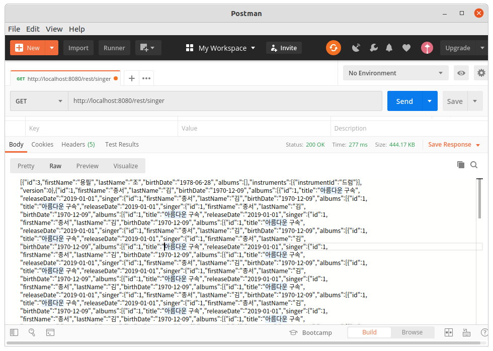

# Spring Rest with JPA
## 프로젝트 생성
jdbc-jpa를 복사하여 프로젝트를 생성한다.  
의존성라이브러리에 spring-web을 추가한다.  
소스 : [pom.xml](pom.xml)  
```xml
	<dependency>
		<groupId>org.springframework.boot</groupId>
		<artifactId>spring-boot-starter-web</artifactId>
	</dependency>
```

## 컨트롤러 생성
컨트롤러는 rest-controller-mybatis에서 생성한 컨트롤러를 그대로 사용한다.  
소스 : [SingerController.java](src/main/java/com/linor/singer/controller/SingerController.java)  
```java
@RestController
@RequestMapping("/rest/singer")
public class SingerController {
	@Autowired
	private SingerDao singerDao;
	
	@GetMapping
	public List<Singer> getSingers(){
		return singerDao.findAllWithAlbums();
	}
	
	@GetMapping(value = "/{id}")
	public Singer getSinger(@PathVariable("id") int id) {
		try {
			return singerDao.findById(id);
		}catch(Exception e) {
			throw new ResourceNotFoundException();
		}
	}
	
	@PostMapping
	public void addSinger(@RequestBody Singer singer) {
		singerDao.insertWithAlbum(singer);
	}
	
	@PutMapping(value="/{id}")
	public void updateSinger(@PathVariable("id") int id, @RequestBody Singer singer) {
		singerDao.update(singer);
	}
	
	@DeleteMapping(value = "/{id}")
	public void deleteSinger(@PathVariable("id") int id) {
		singerDao.delete(id);
	}
}
```

## @JsonIgnore 처리
목록을 조회하기 위해 postman프로그램으로 다음 URL을 호출한다.  
GET http://localhost:8080/rest/singer   
  
Singer와 Album은 1대다의 관계로 서로를 참조하도록 되어 있다.  
엔터티를 JSON으로 변환할 경우 순환참조로 인해 객체표현을 무한반복한다.    
이러한 객체의 무한참조에 의한 반복을 중단하기 위해 @JsonIgnore를 선언한다.  
소스 : [Album.java](src/main/java/com/linor/singer/domain/Album.java)  
```java
@Entity
@Table(uniqueConstraints = {@UniqueConstraint(name = "album_uq_01", columnNames = {"singer_id", "title"})})
@Data
@Builder
@AllArgsConstructor
@NoArgsConstructor
public class Album {
	@Id
	@GeneratedValue(strategy = GenerationType.IDENTITY)
	private Integer id;

	@Column(length = 100)
	private String title;

	private LocalDate releaseDate;

	@ManyToOne
	@JoinColumn(name = "singer_id", foreignKey = @ForeignKey(name="album_fk_01"))
	@ToString.Exclude
	@EqualsAndHashCode.Exclude
	@JsonIgnore
	private Singer singer;

	@Version
	private int version;

}
```
Album클래스의 singer멤버변수에 @JsonIgnore를 선언하여 앨범객체에서 가수를 더이상 JSON객체로 표현하지 않도록 한다.  
목록을 조회하기 위해 postman프로그램으로 다음 URL을 다시 호출한다.  
GET http://localhost:8080/rest/singer   
```json
[
    {
        "id": 3,
        "firstName": "용필",
        "lastName": "조",
        "birthDate": "1978-06-28",
        "albums": [],
        "instruments": [
            {
                "instrumentId": "드럼"
            }
        ],
        "version": 0
    },
    {
        "id": 1,
        "firstName": "종서",
        "lastName": "김",
        "birthDate": "1970-12-09",
        "albums": [
            {
                "id": 1,
                "title": "아름다운 구속",
                "releaseDate": "2019-01-01",
                "version": 0
            },
            {
                "id": 2,
                "title": "날개를 활짝펴고",
                "releaseDate": "2019-02-01",
                "version": 0
            }
        ],
        "instruments": [
            {
                "instrumentId": "피아노"
            },
            {
                "instrumentId": "기타"
            }
        ],
        "version": 0
    },
    {
        "id": 4,
        "firstName": "진아",
        "lastName": "태",
        "birthDate": "2000-11-01",
        "albums": [],
        "instruments": [],
        "version": 0
    },
    {
        "id": 2,
        "firstName": "건모",
        "lastName": "김",
        "birthDate": "1999-07-12",
        "albums": [
            {
                "id": 3,
                "title": "황혼의 문턱",
                "releaseDate": "2019-03-01",
                "version": 0
            }
        ],
        "instruments": [
            {
                "instrumentId": "기타"
            }
        ],
        "version": 0
    }
]
```
결과 더이상 앨범에서 가수가 표현되지 않는다.  
