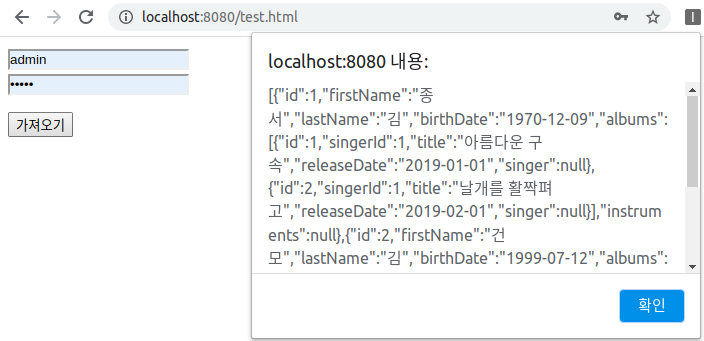
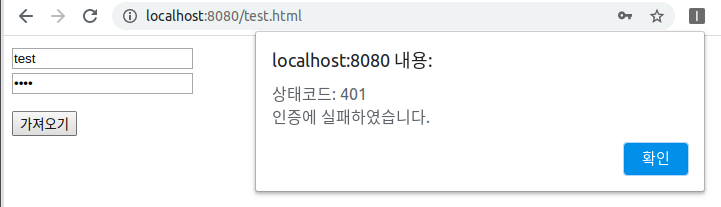
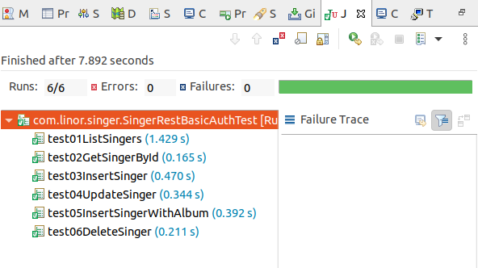

# Spring Boot REST Basic Authentication

## Spring Boot Starter를 이용한 프로젝트 생성
이 프로젝트는 rest-mybatis를 복사하여 프로젝트를 생성한다.  

## 테스트용 html파일 생성
소스 : [test.html](src/main/resources/public/test.html)
```html
<!DOCTYPE html>
<html>
<head>
<meta charset="UTF-8">
<title>REST테스트</title>
<script src="https://code.jquery.com/jquery-3.5.1.min.js" integrity="sha256-9/aliU8dGd2tb6OSsuzixeV4y/faTqgFtohetphbbj0=" crossorigin="anonymous"></script>
<script>
$(document).ready(function(){
	$("#singer").click(function(){
		$.getJSON("http://localhost:8080/rest/singer", function(data, status){
			var strData = JSON.stringify(data);
			alert(strData);
		});
	});
});
</script>
</head>
<body>
	<button id="singer">가수목록 가져오기</button>
</body>
</html>
```
JQuery를 이용하여 백엔드 서버에서 http://localhost:8080/rest/singer를 호출하여 가수 목록을 가져와서 팝업창으로 화면에 결과를 보여준다.  

스프링부트를 시작한다.
```sh
./mvnw spring-boog:run
```

## 테스트
다음은 src/main/resources/public디렉토리에서 Visual Studio Code를 실행한다.  
```sh
src/main/resources/public$ code .
```
test.html파일을 열어서 Visual Studio Code의 확장팩인 Live Server를 실행한다.  
 

스프링부트는 8080포트로 서비스하고, Live Server는 보통 5500포트로 서비스하여 2개의 URL로 테스트한다.  
- 테스트URL1: http://localhost:8080/test.html
- 테스트URL2: http://localhost:5500/test.html

### 8080포트 테스트
테스트URL1: http://localhost:8080/test.html
  
백엔드와 프론트엔드 서버의 출처가 동일하기 때문에 가수목록 가져오기 버튼을 클릭하면 결과를 제대로 보여준다. 

### 5500포트 테스트
테스트URL2: http://localhost:5500/test.html
  
5500포트에서 가수목록 가져오기 버튼을 클릭하면 화면에 아무런 반응이 없다.  

크롬의 개발자도구를 열어 Console탭으로 이동하면 다음과 같은 오류를 확인할 수 있다.  
  

## 1. 컨트롤러 메서드에 어노테이션 설정으로 처리하는 방법
소스 : [SingerController.java](src/main/java/com/linor/singer/controller/SingerController.java)
```java
@RestController
@RequestMapping("/rest/singer")
public class SingerController {
	@Autowired
	private SingerDao singerDao;
	
	@GetMapping
	@CrossOrigin("*")
	public List<Singer> getSingers(){
		return singerDao.findAllWithAlbums();
	}
	...
```
컨트롤러의 메서드에 @CrossOrigin을 선언하여 CORS를 허용할 수 있다.  
출처를 여러개 설정하려면 다음과 같이 설정할 수 있다.
```java
@CrossOrigin(origins = {"http://localhost:5500", "http://127.0.0.1:5500"}) 
```

모든 출처를 허용하려면 다음과 같이 *를 설정한다.  
```java
@CrossOrigin("*"}) 
```
@CrossOrigin를 Class레벨에 선언하면 Class내의 모든 메서드에 적용된다.  


  
결과 5500포트에서도 호출이 가능하게 되었다.  

## 2. WebMvcConfigurer 설정으로 처리하는 방법
WebMvcConfigurer설정을 통하여 CORS를 설정하면 많은 API를 한번에 설정할 수 있다.  
소스 : [CorsConfig.java](src/main/java/com/linor/singer/config/CorsConfig.java)  

```java
@Configuration
public class CorsConfig implements WebMvcConfigurer {
	@Override
	public void addCorsMappings(CorsRegistry registry) {
		registry.addMapping("/rest/**")
			.allowedOrigins("http://localhost:5500")
			.allowedMethods("*")
			.allowedHeaders("*")
			.allowCredentials(false)
			.maxAge(3600);
	}
}
```

## 출처
- https://developer.mozilla.org/ko/docs/Web/HTTP/CORS

 