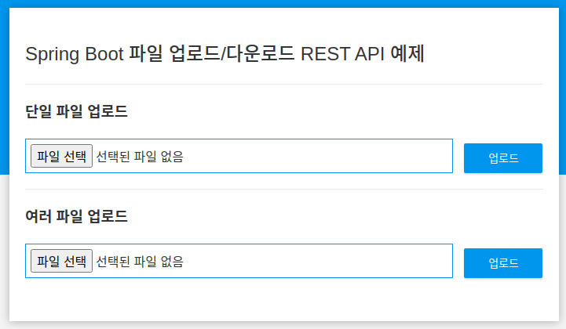
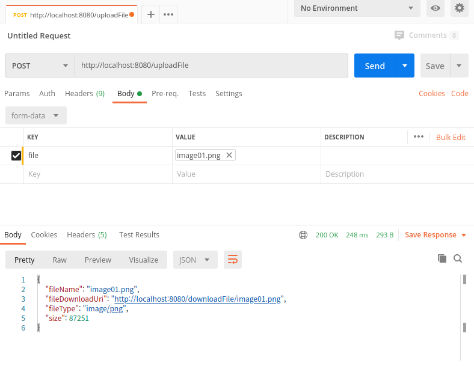
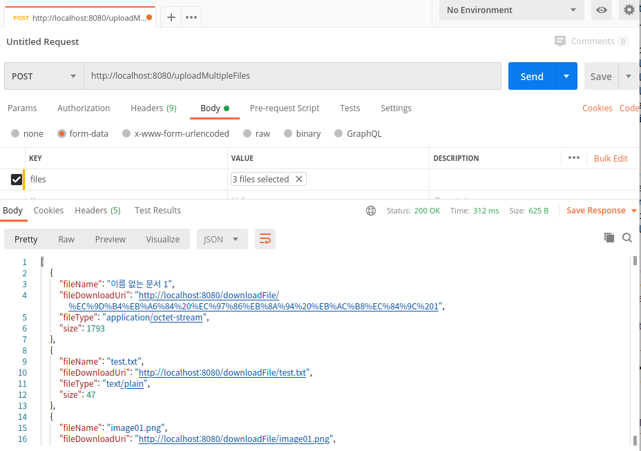
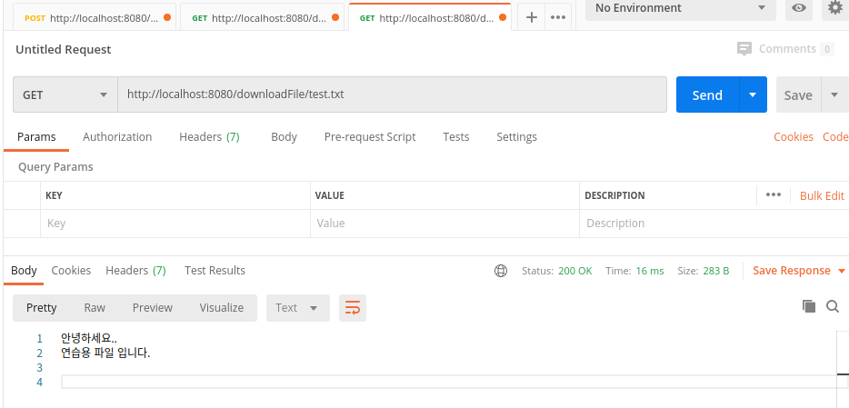

# Spring Boot 업로드/다운로드 Rest API
시스템 개발시 파일업로드/다운로드 대부분 필요한 기능이다.  
RESTful API에서 파일 업로드/다운로드 기능을 구현해 본다.  
먼저 파일 업로드/다운로드를 위한 REST API를 만들어서, Postman프로그램을 이용하여 API를 테스트한다.  
마지막으로 자바스크립트로 파일업로드를 처리하는 프론트엔드 프로그램을 개발한다.  
최종 화면은 다음과 같다.  


## 의존성 라이브러리 
Spring initializer로 생성시 기본 dependency는 Web, DevTools, Lombok를 선택한다.  
소스 : [pom.xml](pom.xml)
```xml
	<dependencies>
		<dependency>
			<groupId>org.springframework.boot</groupId>
			<artifactId>spring-boot-starter-web</artifactId>
		</dependency>
		<dependency>
			<groupId>org.springframework.boot</groupId>
			<artifactId>spring-boot-devtools</artifactId>
			<scope>runtime</scope>
		</dependency>
		<dependency>
			<groupId>org.projectlombok</groupId>
			<artifactId>lombok</artifactId>
			<optional>true</optional>
		</dependency>
		<dependency>
			<groupId>org.springframework.boot</groupId>
			<artifactId>spring-boot-starter-test</artifactId>
			<scope>test</scope>
		</dependency>
		<dependency>
			<groupId>org.webjars</groupId>
			<artifactId>bootstrap</artifactId>
			<version>4.5.0</version>
		</dependency>
	</dependencies>
```
프로젝트 생성 후 pom.xml에 bootstrap을 추가한다.

## 설정
소스 : [application.yml](src/main/resources/application.yml)  
```
spring:
  servlet:
    multipart: #파일 업로드 설정
      enabled: true
      max-file-size: 10MB
      max-request-size: 100MB
      file-size-threshold: 5MB

#업로드파일 저장 위치
myapp.upload-folder: test/
```
Multipart 파일 업로드를 사용할 수 있도록 스프링부트에 설정하고, 업로트파일의 최대 사이즈를 선언한다.  
myapp.upload-folder는 업로드된 파일의 저장위치로 프로젝트 루트폴터 내의 test폴더에 저장하도록 설정한다.  


## 파일 업로드/다운로드 API 생성
소스: [FileController.java](src/main/java/com/linor/singer/controller/FileController.java)  
```java
@RestController
@Slf4j
@RequiredArgsConstructor
public class FileController {

	private final FileStorageService fileService;
	
	@PostMapping("/uploadFile")
	public UploadFileResult uploadFile(@RequestParam("file") MultipartFile file) {
		String fileName = fileService.storeFile(file);
		
		String fileDownloadUri = ServletUriComponentsBuilder.fromCurrentContextPath()
				.path("/downloadFile/")
				.path(fileName)
				.toUriString();
	
		return UploadFileResult.builder()
				.fileName(fileName)
				.fileDownloadUri(fileDownloadUri)
				.fileType(file.getContentType())
				.size(file.getSize())
				.build();
	}
	
	@PostMapping("/uploadMultipleFiles")
	public List<UploadFileResult> uploadMultipleFiles(@RequestParam("files") MultipartFile[] files){
		return Arrays.asList(files)
				.stream()
				.map(file -> uploadFile(file))
				.collect(Collectors.toList());
	}
	
	@GetMapping("/downloadFile/{fileName:.+}")
	public ResponseEntity<Resource> downloadFile(@PathVariable String fileName, HttpServletRequest request){
		Resource resource = fileService.loadFileAsResource(fileName);
		
		String contentType = null;
		try {
			contentType = request.getServletContext().getMimeType(resource.getFile().getAbsolutePath());
		}catch(IOException ex) {
			log.info("Could not determine file type.");
		}
		
		if(contentType == null) {
			contentType = "application/octet-stream";
		}

		return ResponseEntity.ok()
				.contentType(MediaType.parseMediaType(contentType))
				.header(HttpHeaders.CONTENT_DISPOSITION, "attachment: filename=\"" + resource.getFilename() + "\"")
				.body(resource);
	}
	
}
```
파일시스템에 파일을 저장하고 가져오기 위하여 FileStorageService인터페이스를 구현한  FileStorageServiceImpl컴포넌트를 사용한다.  
업로드 완료 후 UploadFileResult에 내용을 담아 객체를 리턴한다.  

### UploadFileResult
UploadFileResult는 도메인 클래스로 '/uploadFile'과 '/uploadMultipleFile' API에서 업로드 결과에 대한 응답을 리턴하기 위해 사용한다.  
소스: [UploadFileResult.java](src/main/java/com/linor/singer/domain/UploadFileResult.java)
```java
@Data
@Builder
public class UploadFileResult {
	private String fileName;
	private String fileDownloadUri;
	private String fileType;
	private long size;
}
```
파일명, 파일다운로드 URL, 파일 타입, 파일크기 정보를 담는다.  

### 파일시스템에 파일을 저장하고 가져오기 위한 서비스
소스: [FileStorageServiceImpl.java](src/main/java/com/linor/singer/service/FileStorageServiceImpl.java)  
```java
@Service
public class FileStorageServiceImpl implements FileStorageService {

	private Path fileStorageLocation;
	
	public FileStorageServiceImpl(@Value("${myapp.upload-dir:test}") String uploadDir) {
		this.fileStorageLocation = Paths.get(uploadDir)
				.toAbsolutePath()
				.normalize();
		try {
			Files.createDirectories(this.fileStorageLocation);
		}catch (Exception e) {
			throw new FileStorageException("Could not create the directory where the uploaded files will be stored.", e);
		}
	}
	
	@Override
	public String storeFile(MultipartFile file) {
		String fileName = StringUtils.cleanPath(file.getOriginalFilename());
		if(!file.isEmpty()) {
			try {
				Path targetLocation = this.fileStorageLocation.resolve(fileName);
	            Files.copy(file.getInputStream(), targetLocation, StandardCopyOption.REPLACE_EXISTING);
			}catch(IOException e) {
				throw new FileStorageException("Could not store file " + fileName + ". Please try again!", e);
			}
		}
		return fileName;
	}
	
	@Override
	public ByteArrayResource loadFileAsResource(String fileName){
		try {
			Path filePath = this.fileStorageLocation.resolve(fileName).normalize();
			byte[] data = Files.readAllBytes(filePath);
			ByteArrayResource resource = new ByteArrayResource(data);
			if(resource.exists()) {
				return resource;
			}else {
				throw new MyFileNotFoundException("File not found" + fileName);
			}
		}catch(MalformedURLException ex) {
			throw new MyFileNotFoundException("File not found" + fileName);
		}catch(IOException e) {
			throw new FileStorageException("Could not retrieve file " + fileName + ". Please try again!", e);
		}
	}
}
```
@Value("${myapp.upload-dir")으로 application.yml에서 설정한 myapp.upload-dir값을 가져와서 uploadDir파라미터에 주입한다.  

## 예외 클래스
FileStorageService구현 클래스에서 예외상황이 발생하는 경우 처리할 예외상황 클래스를 구현한다.  

### FileStorageException
소스: [FileStorageException.java](src/main/java/com/linor/singer/exception/FileStorageException.java)  
파일시스템에 파일 저장시 발생하는 오류에 대한 예외상황이다.  
```java
public class FileStorageException extends RuntimeException {
	private static final long serialVersionUID = -5290293409485429846L;

	public FileStorageException(String message) {
		super(message);
	}
	
	public FileStorageException(String message, Throwable cause) {
		super(message, cause);
	}
}
```

### MyFileNotFoundException
소스: [MyFileNotFoundException.java](src/main/java/com/linor/singer/exception/MyFileNotFoundException.java)  
파일 다운로드시 해당 파일이 존재하지 않을 경우 사용할 예외상황이다.  
```java
@ResponseStatus(HttpStatus.NOT_FOUND)
public class MyFileNotFoundException extends RuntimeException{
	private static final long serialVersionUID = 4560131172861379260L;

	public MyFileNotFoundException(String message) {
		super(message);
	}
	
	public MyFileNotFoundException(String message, Throwable cause) {
		super(message, cause);
	}
}
```
@ResponseStatus(HttpStatus.NOT_FOUND)는 스프링부트가 브라우저에 404 Not Found 상태 응답코드를 전달하도록 한다.  

## Postman프로그램을 이용한 API 테스트
스프링부트를 실행하기 위해 프로젝트 루트폴더에서 다음을 실행한다.  
```bash
03-08-rest-file$ ./mvnw spring-boot:run
```

Postman프로그램에서 다음과 같이 실행한다.  
1. 단일파일 업로드  

method: POST  
URL: http://localhost:8080/uploadFile
BODY탭으로 이동
상단의 선택항목에서 form-data 선택  
key: file, 키의 우측 선택영역에서 File 선택
value: 파일 등록(image01.png)
우측 상단의 Send버튼 클릭  
결과 하단의 Body에 업로드 결과 내용이 JSON타입으로 리턴된다.  

2. 멀티파일 업로드  

method: POST  
URL: http://localhost:8080/uploadMultipleFiles
BODY탭으로 이동
상단의 선택항목에서 form-data 선택  
key: files, 키의 우측 선택영역에서 여러개 파일 등록
value: 등록한 파일(image01.png, test.txt, 이름 없는 문서 1)  
우측 상단의 Send버튼 클릭  
결과 하단의 Body에 업로드 결과 내용이 JSON타입으로 여러 파일이 리턴된다.  

3. 파일 다운로드

method: GET  
URL: http://localhost:8080/downloadFile/test.txt
우측 상단의 Send버튼 클릭  
결과 하단의 Body에 파일의 내용이 나타난다.  

## 프론트엔드 개발
포스트맨으로 백엔드 API가 잘되는 것을 확인하였다. 이제 웹앱으로 파일을 업로드/다운로드할 수 있게 개발한다.  
프론트엔드 파일은 모두 src/main/resources/static폴더 내에 생성한다.  
폴더 구조는 다음과 같다.    
```
static
  └── css
       └── main.css
  └── js
       └── main.js
  └── index.html 
```

소스: [index.html](src/main/resources/static/index.html)
```html
<!DOCTYPE html>
<html>
    <head>
    	 <meta charset="utf-8">
        <meta name="viewport" content="width=device-width, initial-scale=1.0, minimum-scale=1.0">
        <title>Spring Boot 파일 업로드/다운로드 REST API 예제</title>
        <link rel="stylesheet" href="/css/main.css" />
		 <script src="/webjars/jquery/3.5.1/jquery.min.js"></script>
    </head>
    <body>
        <noscript>
            <h2>이 브라우저는 자바스크립트를 지원하지 않습니다.</h2>
        </noscript>
        <div class="upload-container">
            <div class="upload-header">
                <h2>Spring Boot 파일 업로드/다운로드 REST API 예제</h2>
            </div>
            <div class="upload-content">
                <div class="single-upload">
                    <h3>단일 파일 업로드</h3>
                    <form id="singleUploadForm" name="singleUploadForm">
                        <input id="singleFileUploadInput" type="file" name="file" class="file-input" required />
                        <button type="submit" class="primary submit-btn">업로드</button>
                    </form>
                    <div class="upload-response">
                        <div id="singleFileUploadError"></div>
                        <div id="singleFileUploadSuccess"></div>
                    </div>
                </div>
                <div class="multiple-upload">
                    <h3>여러 파일 업로드</h3>
                    <form id="multipleUploadForm" name="multipleUploadForm">
                        <input id="multipleFileUploadInput" type="file" name="files" class="file-input" multiple required />
                        <button type="submit" class="primary submit-btn">업로드</button>
                    </form>
                    <div class="upload-response">
                        <div id="multipleFileUploadError"></div>
                        <div id="multipleFileUploadSuccess"></div>
                    </div>
                </div>
            </div>
        </div>
        <script src="/js/main.js" ></script>
    </body>
</html>
```

소스 : [main.js](src/main/resources/static/js/main.js)  
```js
'use strict';

var singleUploadForm = document.querySelector('#singleUploadForm');
var singleFileUploadInput = document.querySelector('#singleFileUploadInput');
var singleFileUploadError = document.querySelector('#singleFileUploadError');
var singleFileUploadSuccess = document.querySelector('#singleFileUploadSuccess');

function uploadSingleFile(file) {
	var formData = new FormData();
	formData.append("file", file);

	var xhr = new XMLHttpRequest();
	xhr.open("POST", "/uploadFile");

	xhr.onload = function() {
		console.log(xhr.responseText);
		var response = JSON.parse(xhr.responseText);
		if (xhr.status == 200) {
			singleFileUploadError.style.display = "none";
			singleFileUploadSuccess.innerHTML = "<p>File Uploaded Successfully.</p><p>DownloadUrl : <a href='" + response.fileDownloadUri + "' target='_blank'>" + response.fileDownloadUri + "</a></p>";
			singleFileUploadSuccess.style.display = "block";
		} else {
			singleFileUploadSuccess.style.display = "none";
			singleFileUploadError.innerHTML = (response && response.message) || "Some Error Occurred";
		}
	}

	xhr.send(formData);
}

singleUploadForm.addEventListener('submit', function(event) {
	var files = singleFileUploadInput.files;
	if (files.length === 0) {
		singleFileUploadError.innerHTML = "Please select a file";
		singleFileUploadError.style.display = "block";
	}
	uploadSingleFile(files[0]);
	event.preventDefault();
}, true);

$('#multipleUploadForm').submit(function(event) {
	var formElement = this;
	var formData = new FormData(formElement);

	var files = $('#multipleFileUploadInput').prop('files');
	if (files.length === 0) {
		$('#multipleFileUploadError').innerHTML = "Please select at least one file";
		$('#multipleFileUploadError').style.display = "block";
	}
	$.ajax({
		type: "POST",
		enctype: 'multipart/form-data',
		url: "/uploadMultipleFiles",
		data: formData,
		processData: false,
		contentType: false,
		success: function(response) {
			console.log(response);
			$('#multipleFileUploadError').style.display = "none";
			var content = "<p>All Files Uploaded Successfully</p>";
			for (var i = 0; i < response.length; i++) {
				content += "<p>DownloadUrl : <a href='" + response[i].fileDownloadUri + "' target='_blank'>" + response[i].fileDownloadUri + "</a></p>";
			}
			$('#multipleFileUploadSuccess').innerHTML = content;
			$('#multipleFileUploadSuccess').style.display = "block";
		},
		error: function(error) {
			console.log(error);
			$('#multipleFileUploadSuccess').style.display = "none";
			$('#multipleFileUploadError').innerHTML = (response && response.message) || "Some Error Occurred";
		}
	});

	event.preventDefault();
});
```
단일파일 업로드는 순수 자바스크립트로 작성하였고, 멀티파일 업로드는 jquery로 작성하였다.  

소스: [main.css](src/main/resources/static/css/main.css)
```css
* {
    -webkit-box-sizing: border-box;
    -moz-box-sizing: border-box;
    box-sizing: border-box;
}

body {
    margin: 0;
    padding: 0;
    font-weight: 400;
    font-family: "Helvetica Neue", Helvetica, Arial, sans-serif;
    font-size: 1rem;
    line-height: 1.58;
    color: #333;
    background-color: #f4f4f4;
}

body:before {
    height: 50%;
    width: 100%;
    position: absolute;
    top: 0;
    left: 0;
    background: #128ff2;
    content: "";
    z-index: 0;
}

.clearfix:after {
    display: block;
    content: "";
    clear: both;
}


h1, h2, h3, h4, h5, h6 {
    margin-top: 20px;
    margin-bottom: 20px;
}

h1 {
    font-size: 1.7em;
}

a {
    color: #128ff2;
}

button {
    box-shadow: none;
    border: 1px solid transparent;
    font-size: 14px;
    outline: none;
    line-height: 100%;
    white-space: nowrap;
    vertical-align: middle;
    padding: 0.6rem 1rem;
    border-radius: 2px;
    transition: all 0.2s ease-in-out;
    cursor: pointer;
    min-height: 38px;
}

button.primary {
    background-color: #128ff2;
    box-shadow: 0 2px 2px 0 rgba(0, 0, 0, 0.12);
    color: #fff;
}

input {
    font-size: 1rem;
}

input[type="file"] {
    border: 1px solid #128ff2;
    padding: 6px;
    max-width: 100%;
}

.file-input {
    width: 100%;
}

.submit-btn {
    display: block;
    margin-top: 15px;
    min-width: 100px;
}

@media screen and (min-width: 500px) {
    .file-input {
        width: calc(100% - 115px);
    }

    .submit-btn {
        display: inline-block;
        margin-top: 0;
        margin-left: 10px;
    }
}

.upload-container {
      max-width: 700px;
      margin-left: auto;
      margin-right: auto;
      background-color: #fff;
      box-shadow: 0 1px 11px rgba(0, 0, 0, 0.27);
      margin-top: 60px;
      min-height: 400px;
      position: relative;
      padding: 20px;
}

.upload-header {
    border-bottom: 1px solid #ececec;
}

.upload-header h2 {
    font-weight: 500;
}

.single-upload {
    padding-bottom: 20px;
    margin-bottom: 20px;
    border-bottom: 1px solid #e8e8e8;
}

.upload-response {
    overflow-x: hidden;
    word-break: break-all;
}
```
결과 맨 위그림의 우리가 원하는 최종 화면을 구현하였다.  

## 참고 사이트 
https://www.callicoder.com/spring-boot-file-upload-download-rest-api-example/
