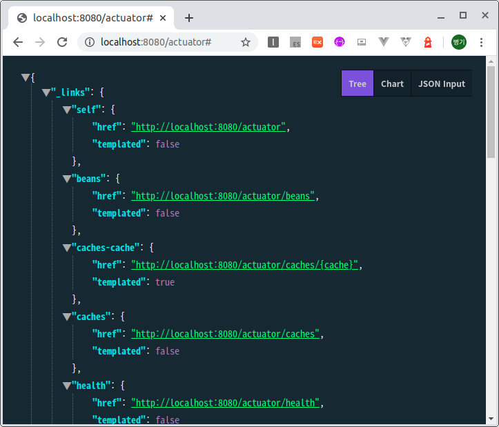
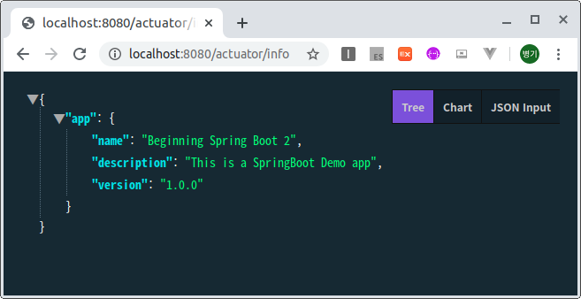
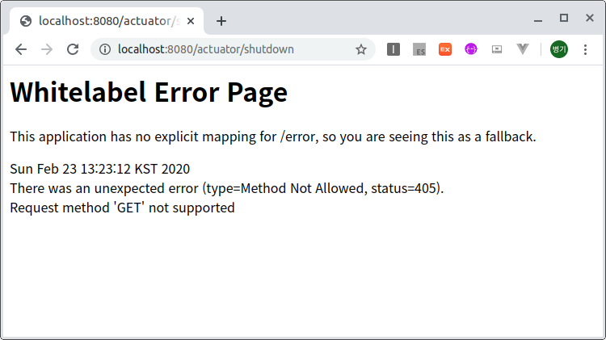
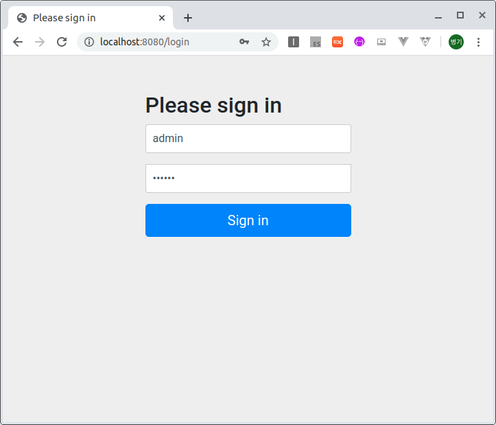

# Actuator
Spring Boot Actuator는 어플리케이션을 모니터링하고 제어하기 위해 사용한다.

## Spring Boot Starter를 이용한 프로젝트 생성
Spring Boot -> Spring Starter Project로 생성한다.  
spring-boot-starter-web, spring-boot-starter-actuator, spring-boot-starter-security를 추가한다.

### 의존성 라이브러리
소스 : [pom.xml](pom.xml)
```xml   
	<dependencies>
		<dependency>
			<groupId>org.springframework.boot</groupId>
			<artifactId>spring-boot-starter-actuator</artifactId>
		</dependency>
		<dependency>
			<groupId>org.springframework.boot</groupId>
			<artifactId>spring-boot-starter-web</artifactId>
		</dependency>
	</dependencies>
```   

### application.yml에 actuator 설정사항 추가
소스 : [applicaition.yml](src/main/resources/applicaition.yml)
```yml
management:
  endpoints:
    web:
#      base-path: /app #디폴트 /actuator
      exposure:
        include: '*'
```
management.endpoints.web.exposure.include에 *를 설정함으로써 모든 자원을 볼 수 있도록 한다.
노출을 제외하려면 management.endpoints.web.exposure.exclude에 추가한다.
디폴트 패스가 /actuator로 변경하려면 base-path를 설정하면 된다.  
 
### 테스트
프로젝트를 구동하고, 브라우저에서 다음 url을 연다.  
http://localhost:8080/actuator

결과 조회화면

## 어플리케이션의 정보 추가
### application.yml에 내용을 추가
소스 : [applicaition.yml](src/main/resources/applicaition.yml)
```yml
info:
  app:
    name: Beginning Spring Boot 2
    description: This is a SpringBoot Demo app
    version: 1.0.0
```
### 테스트
http://localhost:8080/actuator/info

결과 

## Shutdown기능 추가
### application.yml에 내용을 추가
소스 : [applicaition.yml](src/main/resources/applicaition.yml)
```yml
management:
  endpoint:
    shutdown:
      enabled: true
```
### 테스트
브라우저에서 다음 URL을 열어본다.
http://localhost:8080/actuator/shuwdown

결과 오류가 발생한다.
로그를 보면 다음과 같다.
```log
Resolved [org.springframework.web.HttpRequestMethodNotSupportedException: Request method 'GET' not supported]
```
어플리케이션을 종료하는 기능은 POST방식으로 처리해야 한다.
POST방식으로 처리하기 위해서 HTML 폼을 구현하거나 PostMan으로 처리한다.

## 보안 추가
### 의존성 라이브러리
소스 : [pom.xml](pom.xml)
```xml   
		<dependency>
			<groupId>org.springframework.boot</groupId>
			<artifactId>spring-boot-starter-security</artifactId>
		</dependency>
```   
의존성 라이브러리에 spring-boot-starter-security를 추가한다.

### application.yml에 보안 설정사항 추가
소스 : [applicaition.yml](src/main/resources/applicaition.yml)
```yml
spring:
  security:
    user:
      name: admin
      password: secret
      roles:
      - ADMIN
```
디폴트 사용자와 사용자의 비밀번호를 설정한다. 
권한은 ADMIN으로 한다.  

### 테스트
프로젝트를 다시 구동하고, 브라우저에서 다음 url을 연다.  
http://localhost:8080/actuator

결과 사용자와 비밀번호를 입력하도록 한다.  

결과 

### health 엔드포인트
health엔드 포인트는 어플리케이션의 상태 정보를 표시한다.
URL : http://localhost:8080/actuator/health
```json
{"status":"UP"}
```
결과 위와 같은 화면이 나타남.

좀 더 자세한 정보를 보려면 설정사항을 수정한다.  
```yml
management:
  endpoint:
    health:
      show-details: always # when-authorized
```
management.endpoint.health.show-details는 always나 when-authorized 둘 중 하나로 설정할 수 있다.

URL : http://localhost:8080/actuator/health
```json
{
	"status": "UP",
	"components": {
		"diskSpace": {
		"status": "UP",
		"details": {
		"total": 185486336000,
		"free": 148835966976,
		"threshold": 10485760
		}
	},
	"ping": {
		"status": "UP"
		}
	}
}
```
결과 위와 같은 화면이 나타남.

### health엔트리포인트 생성
나만의 health엔트리포인트를 생성해 본다.

소스 : [FeedServerHealthIndicator.java](src/main/com/linor/singer/component/FeedServerHealthIndicator.java)
```java
@Component
public class FeedServerHealthIndicator implements HealthIndicator {

	@Override
	public Health health() {
		RestTemplate restTemplate = new RestTemplate();
		String url = "http://feedserver.com/ping";
		try {
			String resp = restTemplate.getForObject(url, String.class);
			if("OK".equalsIgnoreCase(resp)) {
				return Health.up()
						.build();
			}else {
				return Health.down()
						.withDetail("ping_url", url)
						.withDetail("ping_time", new Date())
						.build();
			}
		}catch(RestClientException e) {
			return Health.down(e)
					.withDetail("ping_url", url)
					.withDetail("ping_time", new Date())
					.build();
		}
	}
}
```
RestTemplate를 이용하여 http://feedserver.com/ping를 접속하여 OK메시지를 받으면 UP을 표시하고, 그렇지 않으면 DOWN상태와 URL,시간을 표시하도록 한다.
URL : http://localhost:8080/actuator/health
```json
{
"status": "DOWN",
"components": {
"diskSpace": {
"status": "UP",
"details": {
"total": 185486336000,
"free": 148835770368,
"threshold": 10485760
}
},
"feedServer": {
"status": "DOWN",
"details": {
"error": "org.springframework.web.client.HttpClientErrorException$BadRequest: 400 Bad Request: [no body]",
"ping_url": "http://feedserver.com/ping",
"ping_time": "2020-03-01T01:30:12.881+0000"
}
},
"ping": {
"status": "UP"
}
}
}
```
