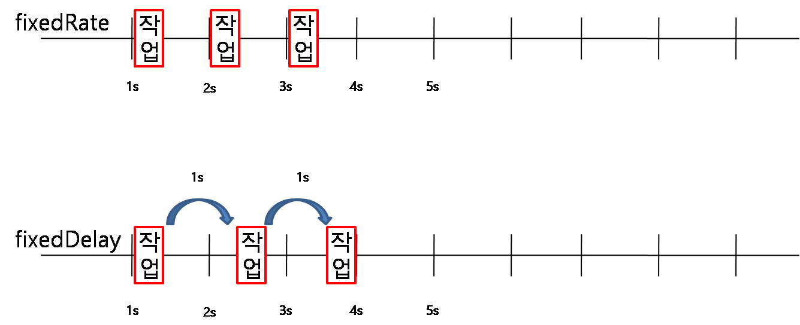

# Spring Scheduler
스케줄러는 일정주기마다 정해진 작업을 수행하도록 한다.  
작업중에 주기적으로 DB를 백업하거나 특정시간 혹은 몇분 혹은 몇시간마다 동작하여 외부 시스템에 접속하여 데이터를 가져오는 등의 경우에 crontab과 같이 동작하는 프로그램을 스프링으로 구현할 수있다.  

## 의존성 라이브러리
소스 : [pom.xml](pom.xml)
```xml
	<dependencies>
		<dependency>
			<groupId>org.springframework.boot</groupId>
			<artifactId>spring-boot-starter</artifactId>
		</dependency>
		<dependency>
			<groupId>org.springframework.boot</groupId>
			<artifactId>spring-boot-devtools</artifactId>
			<scope>runtime</scope>
		</dependency>
		<dependency>
			<groupId>org.springframework.boot</groupId>
			<artifactId>spring-boot-starter-test</artifactId>
			<scope>test</scope>
		</dependency>
		<dependency>
			<groupId>org.projectlombok</groupId>
			<artifactId>lombok</artifactId>
		</dependency>
	</dependencies>
```
스케줄러는 기본 spring-boot-starter에 포함되어 있어 별도의 추가 의존성 라이브러리가 필요하지 않다.  

## 설정
소스 : [Application.java](src/main/java/com/linor/singer/Application.java)
```java
@EnableScheduling
@SpringBootApplication
public class Application {
	public static void main(String[] args) {
		SpringApplication.run(Application.class, args);
	}
}
```
메인 클래스나 설정 클래스에 @EnableScheduling을 선언하여 스케줄링을 사용할 수 있도록 한다.  

## 스케줄러용 서비스 생성
소스 : [ScheduleService.java](src/main/java/com/linor/singer/schedule/ScheduleService.java)
```java
@Slf4j
@Service
public class ScheduleService {
	@Scheduled(fixedDelay=1000)
	public void logService1() {
		log.info("fixedDelay 작업 스케줄 테스트");
	}

	@Scheduled(fixedRate=1000)
	public void logService2() {
		log.info("fixedRate 작업 스케줄 테스트");
	}
	
	@Scheduled(cron="0/3 * * * * ?")
	public void logService3() {
		log.info("cron 스케줄 테스트");
	}
}
```
스케줄러 생성은 간단하다. 메서드에 @Scheduled어노테이션만 추가하면 된다.  - 
@Scheduled에 속성을 설정하여 실행 주기를 설정할 수 있다.  
- cron : cron표현식을 지원한다. "초 분 시 일 월 주 (년)"으로 표현한다.
- fixedDelay : milliseconds 단위로, 이전 작업이 끝난 시점으로 부터 고정된 시간을 설정한다. ex) fixedDelay = 5000
- fixedDelayString : fixedDelay와 같은데 property의 value만 문자열로 넣는 것이다. ex) fixedDelay = "5000"
- fixedRate : milliseconds 단위로, 이전 작업이 수행되기 시작한 시점으로 부터 고정된 시간을 설정한다. ex) fixedRate = 3000
- fixedRateString : fixedDelay와 같은데 property의 value만 문자열로 넣는 것이다. ex) fixedRate = "3000"
- initialDelay : 스케줄러에서 메서드가 등록되자마자 수행하는 것이 아닌 초기 지연시간을 설정하는 것이다.
- initialDelayString : 위와 마찬가지로 문자열로 값을 표현하겠다는 의미다.
- zone : cron표현식을 사용했을 때 사용할 time zone으로 따로 설정하지 않으면 기본적으로 서버의 time zone이다.

### fixedDelay vs fixedRate

Rate는 작업 수행시간과 상관없이 일정 주기마다 메서드 호출을 시켜주는 것이고,  
Delay는 (작업 수행 시간을 포함하여) 작업을 마친 후부터 주기 타이머가 돌아 메서드를 호출해주는 것이다.

## 스케줄러 풀 설정
springboot 2.0에서는 auto-configration이 있기 때문에 스프링부트가 알아서 스케줄러를 생성해준 것인데, 이 스케줄러의 경우 쓰레드풀이 아니기 때문에 많은 작업이 있을 때 효율적이지 못하다.  
그래서 커스터마이징을 해주는 것이 좋다.  
소스: [application.yml](src/main/resources/application.yml)
```yml
spring:
  task:
    scheduling:
      pool:
        size: 10
      thread-name-prefix: linor-scheduler
```
- size: 풀사이즈를 10으로 설정
- thread-name-prefix: 스레드 명 설정

설정 후 실행하면 다음과 같은 결과를 얻을 수 있다.  
```log
2020-07-25 13:08:48.001  INFO 85904 --- [inor-scheduler1] c.linor.singer.schedule.ScheduleService  : cron 스케줄 테스트
2020-07-25 13:08:48.925  INFO 85904 --- [inor-scheduler7] c.linor.singer.schedule.ScheduleService  : fixedRate 작업 스케줄 테스트
2020-07-25 13:08:48.929  INFO 85904 --- [inor-scheduler4] c.linor.singer.schedule.ScheduleService  : fixedDelay 작업 스케줄 테스트
2020-07-25 13:08:49.926  INFO 85904 --- [inor-scheduler8] c.linor.singer.schedule.ScheduleService  : fixedRate 작업 스케줄 테스트
2020-07-25 13:08:49.930  INFO 85904 --- [inor-scheduler2] c.linor.singer.schedule.ScheduleService  : fixedDelay 작업 스케줄 테스트
```

## 참고 URL
- https://jeong-pro.tistory.com/186