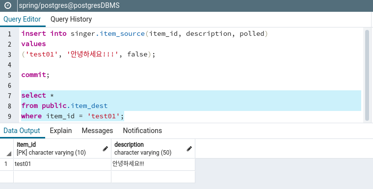

# Jdbc Channel Adapter
dataSource1의 item_source테이블의 polled칼럼이 false인 모든 레코드를 읽은 후 polled칼럼을 true로 변경하고, dataSource2의 item_dest테이블에 저장하는 구조를 구현한다.  

## Maven Dependency
소스: [pom.xml](pom.xml)  
```xml
	<dependencies>
		<dependency>
			<groupId>org.springframework.boot</groupId>
			<artifactId>spring-boot-starter-integration</artifactId>
		</dependency>
		<dependency>
			<groupId>org.springframework.boot</groupId>
			<artifactId>spring-boot-devtools</artifactId>
			<scope>runtime</scope>
		</dependency>
		<dependency>
			<groupId>org.projectlombok</groupId>
			<artifactId>lombok</artifactId>
			<optional>true</optional>
		</dependency>
		<dependency>
			<groupId>org.springframework.integration</groupId>
			<artifactId>spring-integration-jdbc</artifactId>
		</dependency>
		<dependency>
			<groupId>org.springframework.boot</groupId>
			<artifactId>spring-boot-starter-test</artifactId>
			<scope>test</scope>
		</dependency>
		<dependency>
			<groupId>org.postgresql</groupId>
			<artifactId>postgresql</artifactId>
			<scope>runtime</scope>
		</dependency>
		<dependency>
			<groupId>org.springframework.boot</groupId>
			<artifactId>spring-boot-starter-jta-atomikos</artifactId>
		</dependency>		
	</dependencies>
```
- spring-boot-starter-integration: 스프링 Integration을 사용하기 위한 라이브러리.  
- spring-integration-jdbc: jdbc Channel Adapter를 사용을 위한 라이브러리.  
- 사용 데이터베이스는 postgresql로 한다.  
- spring-boot-starter-jta-atomikos: 보통 JDBC어뎁터를 사용하는 경우 2개 이상의 데이타베이스를 사용한다. JTA데이타소스를 사용하여 트랜잭션을 보장하도록 한다.  

## 소스 데이타소스 스키마 및 입력 데이타
소스: [schema1.sql](src/main/resources/schema1.sql)  
```sql
drop table if exists item_source cascade;
create table item_source(
  item_id varchar(10) primary key,
  description varchar(50) not null,
  polled boolean not null
);
```
소스 데이타베이스에 item_source테이블을 생성한다.  

소스: [data1.sql](src/main/resources/data1.sql)  
```sql
INSERT INTO item_source (ITEM_ID, DESCRIPTION, polled) 
VALUES
   ('Item_id0', 'Item_description0', 'false'),
   ('Item_id1', 'Item_description1', 'false'),
   ('Item_id2', 'Item_description2', 'false'),
   ('Item_id3', 'Item_description3', 'false'),
   ('Item_id4', 'Item_description4', 'false'),
   ('Item_id5', 'Item_description5', 'false'),
   ('Item_id6', 'Item_description6', 'false'),
   ('Item_id7', 'Item_description7', 'false'),
   ('Item_id8', 'Item_description8', 'false'),
   ('Item_id9', 'Item_description9', 'false');
```
item_source에 10개의 레코드를 입력한다.  

소스: [schema2.sql](src/main/resources/schema2.sql)  
```sql
drop table if exists item_dest cascade;
create table item_dest(
  item_id varchar(10) primary key,
  description varchar(50) not null
);
```
대상 데이타베이스에 item_dest테이블을 생성한다.  

## 데이터베이스 드라이버 설정
소스: [application.yml](src/main/resources/application.yml)  
```yml
#데이타소스
#Multi DataSource 설정
db:
  db1: 
    datasource:
      unique-resource-name: dataSource1
      max-pool-size: 5
      min-pool-size: 1
      max-life-time: 20000
      borrow-connection-timeout: 10000
      xa-data-source-class-name: org.postgresql.xa.PGXADataSource
      xa-properties:
        user: linor
        password: linor1234
        URL: jdbc:postgresql://postgres:5432/spring?currentSchema=singer
  db2: 
    datasource:
      unique-resource-name: dataSource2
      max-pool-size: 5
      min-pool-size: 1
      max-life-time: 20000
      borrow-connection-timeout: 10000
      xa-data-source-class-name: org.postgresql.xa.PGXADataSource
      xa-properties:
        user: linor
        password: linor1234
        URL: jdbc:postgresql://postgres:5432/spring?currentSchema=public
```
Atomikos JTA 데이타소스를 생성할 2개의 데이타베이스 설정값을 등록한다.  

소스: [DatasourceConfig.java](src/main/java/com/linor/singer/config/DatasourceConfig.java)
```java
@Configuration
public class DatasourceConfig {
	@Bean
	@ConfigurationProperties("db.db1.datasource")
	@Primary
	public DataSource dataSource1() {
		return new AtomikosDataSourceBean();
	}
	
    @Bean
    public DataSourceInitializer dataSourceInitializer1(@Qualifier("dataSource1") DataSource datasource) {
        ResourceDatabasePopulator resourceDatabasePopulator = new ResourceDatabasePopulator();
        resourceDatabasePopulator.addScript(new ClassPathResource("schema1.sql"));
        resourceDatabasePopulator.addScript(new ClassPathResource("data1.sql"));

        DataSourceInitializer dataSourceInitializer = new DataSourceInitializer();
        dataSourceInitializer.setDataSource(datasource);
        dataSourceInitializer.setDatabasePopulator(resourceDatabasePopulator);
        return dataSourceInitializer;
    }

	@Bean
	@ConfigurationProperties("db.db2.datasource")
	public DataSource dataSource2() {
		return new AtomikosDataSourceBean();
	}

    @Bean
    public DataSourceInitializer dataSourceInitializer2(@Qualifier("dataSource2") DataSource datasource) {
        ResourceDatabasePopulator resourceDatabasePopulator = new ResourceDatabasePopulator();
        resourceDatabasePopulator.addScript(new ClassPathResource("schema2.sql"));

        DataSourceInitializer dataSourceInitializer = new DataSourceInitializer();
        dataSourceInitializer.setDataSource(datasource);
        dataSourceInitializer.setDatabasePopulator(resourceDatabasePopulator);
        return dataSourceInitializer;
    }
}
```
- dataSource1(): db.db1.datasource설정값을 이용하여 데이타소스를 생성한다.    
- dataSourceInitializer1(): schema1.sql, data1.sql을 이용하여 테이블생성 및 자료등록 초기화를 수행한다.  
- dataSource2(): db.db2.datasource설정값을 이용하여 데이타소스를 생성한다.  
- dataSourceInitializer2(): schema2.sql을 이용하여 테이블을 생성한다.  

## Integration Flow 생성(XML 방식)
소스: [int-jdbc-channel.xml](src/main/resources/int-jdbc-channel.xml)  
```xml
<?xml version="1.0" encoding="UTF-8"?>
<beans xmlns="http://www.springframework.org/schema/beans"
	xmlns:xsi="http://www.w3.org/2001/XMLSchema-instance"
	xmlns:int="http://www.springframework.org/schema/integration"
	xmlns:int-jdbc="http://www.springframework.org/schema/integration/jdbc"
	xsi:schemaLocation="http://www.springframework.org/schema/integration/jdbc http://www.springframework.org/schema/integration/jdbc/spring-integration-jdbc.xsd
		http://www.springframework.org/schema/beans http://www.springframework.org/schema/beans/spring-beans.xsd
		http://www.springframework.org/schema/integration http://www.springframework.org/schema/integration/spring-integration-5.2.xsd">
	<int:channel id="channel"/>
	<int-jdbc:inbound-channel-adapter id="fromDb" channel="channel"
			data-source="dataSource1"
			query="select * from item_source where polled = false"
			update="update item_source set polled = 'true' where item_id in (:item_id)">
		<int:poller fixed-rate = "4000"/>
	</int-jdbc:inbound-channel-adapter>
	<int-jdbc:outbound-channel-adapter id="toDb" channel="channel"
			data-source="dataSource2">
		<int-jdbc:query>insert into item_dest(item_id, description) values(:payload[item_id], :payload[description])</int-jdbc:query>
	</int-jdbc:outbound-channel-adapter>	
</beans>
```
- &lt;int:channel/&gt;: 채널을 생성한다.  
- &lt;int-jdbc:inbound-channel-adapter/&gt;: 인바운드 채널 어뎁터를 생성한다.  
  - data-source: dataSource1을 등록한다.  
  - query속성값에 조회용 sql문을 등록한다.
  - 조회한 내역을 다음에 다시 조회하지 않도록 update속성값에 polled칼럼을 true로 변경하는 sql문을 등록한다. :item_id는 쿼리 조회후 리턴받은 ResultSet의 item_id값을 sql파라미터로 재사용한다. item_id의 값은 배열값이므로 in을 사용하여 조회한다.  
  - &lt;int:poller&gt;: fixed-rate=”4000” 폴링 타임을 4초로 지정

- &lt;int-jdbc:outbound-channel-adapter&gt;: 아웃바운드 채널 어뎁터를 생성한다.
  - query에 item_dest테이블에 insert할 sql문을 등록한다.
  - :payload[item_id], :payload[description]는 메시지 페이로드에 있는 item_id와 description값을 사용한다.

## ImportResource설정
메인 클래스나 설정클래스에 @ImportResource로 체널 어뎁터 xml파일을 등록한다.  
소스: [Application.java](src/main/java/com/linor/singer/Application.java)  
```java
@SpringBootApplication
@ImportResource("classpath:int-jdbc-channel.xml")
public class Application {

	public static void main(String[] args) {
		SpringApplication.run(Application.class, args);
	}
}
```

## 결과 테스트
스프링부트를 실행한 후 pgAdmin에서 다음 sql을 실행한다.  
```sql
insert into singer.item_source(item_id, description, polled)
values
('test01', '안녕하세요!!!', false);

commit;

select *
from public.item_dest
where item_id = 'test01';
```
결과  


## 참고 URL
- https://examples.javacodegeeks.com/enterprise-java/spring/integration/spring-integration-database-polling-example/

