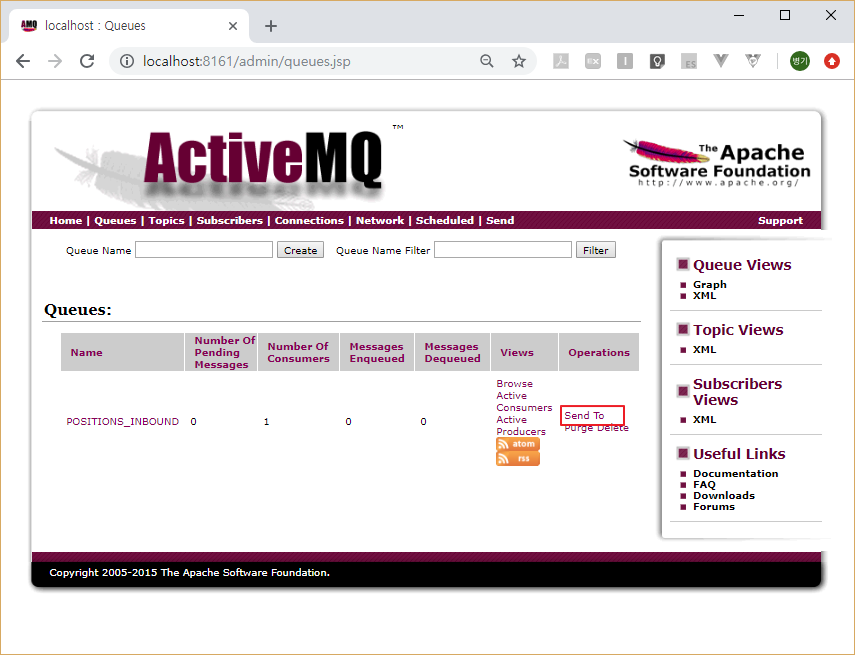
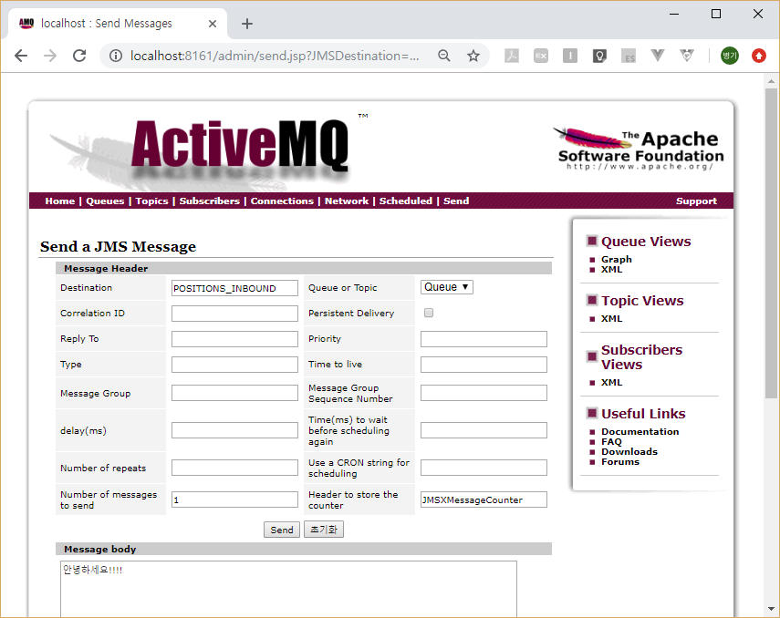
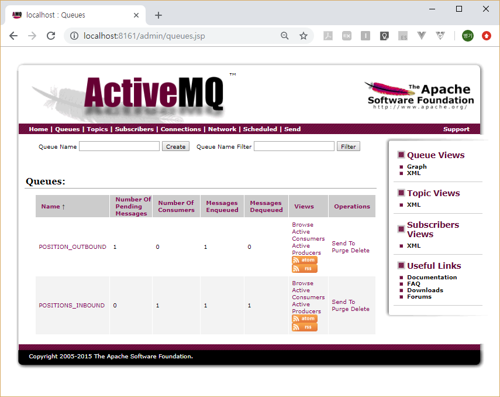
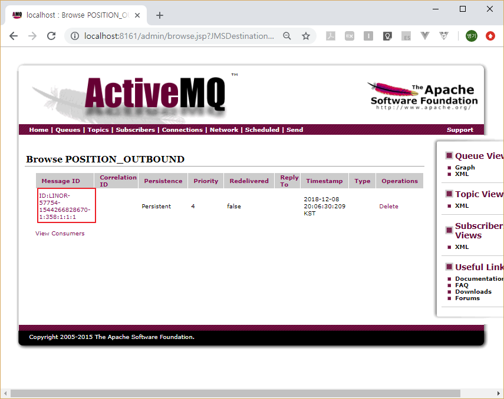
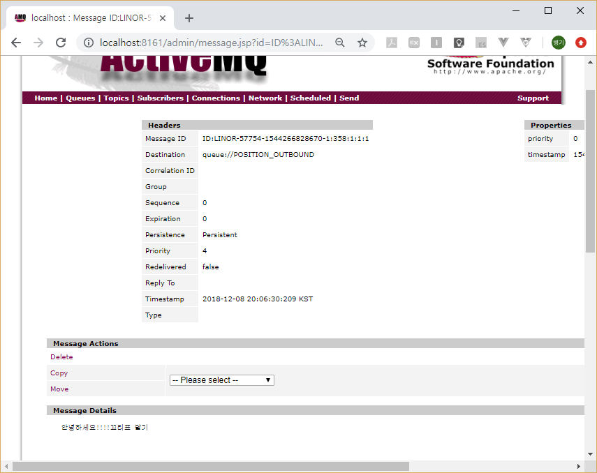

# JMS Channel Adapter

## Maven Dependency
소스: [pom.xml](pom.xml)  
```xml
	<dependencies>
		<dependency>
			<groupId>org.springframework.boot</groupId>
			<artifactId>spring-boot-starter-integration</artifactId>
		</dependency>
		<dependency>
			<groupId>org.springframework.integration</groupId>
			<artifactId>spring-integration-jms</artifactId>
		</dependency>
		<dependency>
			<groupId>org.springframework.boot</groupId>
			<artifactId>spring-boot-starter-activemq</artifactId>
		</dependency>
		<dependency>
			<groupId>org.springframework.boot</groupId>
			<artifactId>spring-boot-devtools</artifactId>
			<scope>runtime</scope>
		</dependency>
		<dependency>
			<groupId>org.projectlombok</groupId>
			<artifactId>lombok</artifactId>
			<optional>true</optional>
		</dependency>
		<dependency>
			<groupId>org.springframework.boot</groupId>
			<artifactId>spring-boot-starter-test</artifactId>
			<scope>test</scope>
		</dependency>
	</dependencies>
```
- spring-boot-starter-integration: 스프링 Integration을 사용하기 위한 라이브러리.  
- spring-integration-jms: JMS Channel Adapter를 사용을 위한 라이브러리.  
- spring-boot-starter-activemq: ActiveMQ JMS서버 연동 라이브러리

## Message Converter

소스: [MyMessageConverter.java](src/main/java/com/linor/singer/adapter/MyMessageConverter.java)  
```java
@Component
@Slf4j
public class MyMessageConverter implements MessageConverter {
	@Override
	public Object fromMessage(Message message) throws JMSException, MessageConversionException {
		log.info("From 메시지 : " + message);
		TextMessage textMessage = (TextMessage)message;
		String messageData = textMessage.getText();
		return messageData;
	}

	@Override
	public Message toMessage(Object object, Session session) throws JMSException, MessageConversionException {
		String textData = (String) object;
		log.info("To 메시지 : " + textData);
		textData += "꼬리표 달기";
		TextMessage message = session.createTextMessage(textData);
		return message;
	}
}
```
- MessageConverter인터페이스를 상속받아서 구현한다.  
- fromMessage는 Inbound Message Channel Adapter에서 사용한다. 
- toMessage는 Outbound Message Channel Adapter에서 사용한다.  
테스트 메시지를 받아서 메시지 끝에 “꼬리표 달기”를 추가하여 내보낸다.  


## Integration Flow 생성(XML 방식)
소스: [int-jms-channel.xml](src/main/resources/int-jms-channel.xml)  
```xml
<?xml version="1.0" encoding="UTF-8"?>
<beans xmlns="http://www.springframework.org/schema/beans"
	xmlns:xsi="http://www.w3.org/2001/XMLSchema-instance"
	xmlns:int="http://www.springframework.org/schema/integration"
	xmlns:int-jms="http://www.springframework.org/schema/integration/jms"
	xsi:schemaLocation="http://www.springframework.org/schema/beans http://www.springframework.org/schema/beans/spring-beans.xsd
		http://www.springframework.org/schema/integration/jms http://www.springframework.org/schema/integration/jms/spring-integration-jms-5.2.xsd
		http://www.springframework.org/schema/integration http://www.springframework.org/schema/integration/spring-integration-5.2.xsd">
	<bean name="connectionFactory" class="org.apache.activemq.ActiveMQConnectionFactory">
		<property name="brokerURL" value="tcp://localhost:61616"/>
		<property name="userName" value="admin"/>
		<property name="password" value="admin"/>
	</bean>
	<int:channel id="channel"/>
	<int-jms:inbound-channel-adapter 
		id="inboundJmsAdapter"
		channel="channel"
		connection-factory="connectionFactory"
		destination-name="POSITIONS_INBOUND"
		message-converter="myMessageConverter">
		<int:poller fixed-rate="1000"/>
	</int-jms:inbound-channel-adapter>
 	<int-jms:outbound-channel-adapter
 		id="outboundJmsAdapter"
 		channel="channel"
 		connection-factory="connectionFactory"
 		message-converter="myMessageConverter"
 		destination-name="POSITION_OUTBOUND"/>
</beans>
```
- ActiveMQConnectionFactory클래스로 connectionFactory빈을 생성한다.
  - brokerURL: 접속 URL(tcp://localhost:61616)
  - userName: 접속계정
  - password: 비밀번호
- &lt;int:channel/&gt;: JMS 어댑터가 사용할 채널을 선언한다.    
- &lt;int-jms:inbound-channel-adapter/&gt;: 인바운드 JMS 채널 어댑터  
  - connection-factory: 위에서 선언한 connectionFactory빈을 등록  
  - channel: 사용할 채널 등록.
  - destination-name: 받아올 JMS의 Queue를 등록
  - message-converter: 메시지의 내용을 변경하는 경우 컨버터 빈을 등록
  - &lt;int:poller&gt;: fixed-rate=”1000” 폴링 타임을 1초로 지정

- &lt;int-jms:outbound-channel-adapter&gt;: 아웃바운드 JMS채널 어댑터
  - connection-factory: 위에서 선언한 connectionFactory빈을 등록  
  - channel: 사용할 채널 등록.
  - destination-name: 내보낼 JMS의 Queue를 등록
  - message-converter: 내보내기 전 메시지의 내용을 변경하는 경우 컨버터 빈을 등록

## ImportResource설정
메인 클래스나 설정클래스에 @ImportResource로 체널 어뎁터 xml파일을 등록한다.  
소스: [Application.java](src/main/java/com/linor/singer/Application.java)  
```java
@SpringBootApplication
@ImportResource("classpath:int-jms-channel.xml")
public class Application {

	public static void main(String[] args) {
		SpringApplication.run(Application.class, args);
	}
}
```

## 결과 테스트
ActiveMQ서버를 실행 후 스프링부트 어플리케이션을 실행한다.  
브라우저에서 ActiveMQ서버의 관리자페이지에 접속한다.  
URL : http://localhost:8161/admin/  
계정 : admin/admin  
  
메뉴에서 Queues를 클릭.  
큐 이름이 POSITIONS_INBOUND에 해당하는 Send to링크를 클릭한다.  

 
Message body에 메시지를 입력하고 Send버튼을 클릭한다.  

  
다시 Queues메뉴로 돌아오면 해당 페이지를 새로고침한다.  
POSITIONS_OUTBOUND큐가 추가된 것을 확인하고 POSITIONS_OUTBOUND의 Browse링크를 클릭한다.  

  
메시지 ID를 클릭한다.  

  
화면 하단의 수신받은 메시지에 “꼬리표 달기”라는 내용이 추가되어 표시되는 것을 확인한다.  

## 참고 URL
